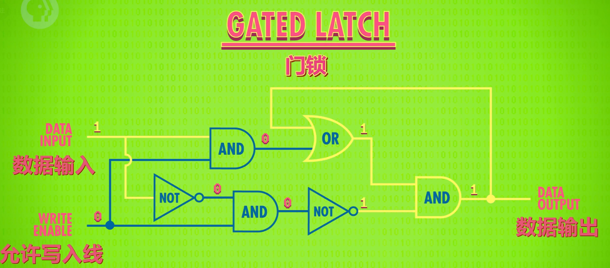
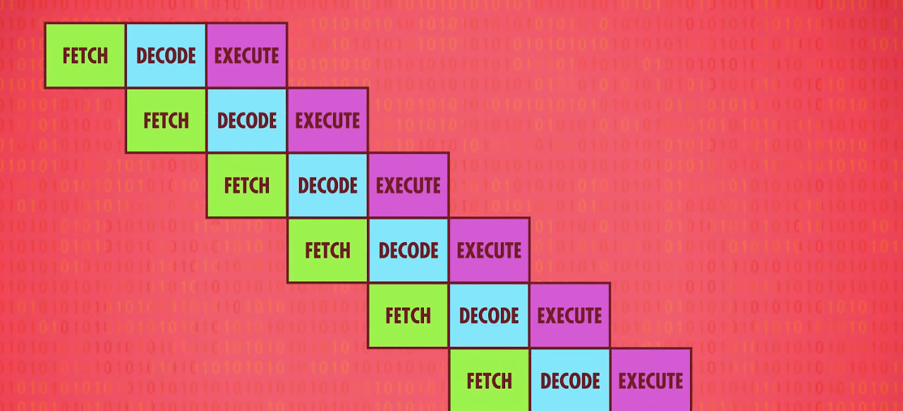
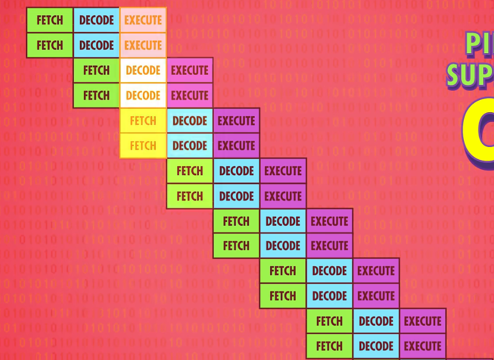

# computer crash course

## the history of computer

开关：继电器 真空管 晶体管 transistors  
become smaller, safer, and faster

布尔代数 the math base of computer

## data storage and expression

binary  
we use a **bit ​**to express one 0 or 1

and most of time we would put 8 bits together and we called it **byte**  
a byte = 8 bits

we also heard the term 32-bit computer or 64-bit computer  
it means your computer is operating in chunks of 32 or 64 bits(处理一块块数据，每块是32 或者 64 位

we need to express negative number and we often choose to check the **first bit** of a chunk of bits for sign  
**negative or positive**  
besides we need to express float number

for text, we have ASCII to code each word like 'a' 'b' 'C' and some punctuation marks(标点) or signs  
and it is enough for most of English text.

however ASCII is only for English and if each coutry design a coding standard for their own language  
it's hard for exchange data. So when 1992, the **unicode was born**, it has 16bits could express every language  
on the world.

## calculate

in computer we have ALU to do the calculation

## register and RAM

there three types way to store information  
hera we talked about register and RAM

门锁是一种可以存储一位数据，并且可以锁定其中数据或者解锁的门电路结构

​​

register is a group of gate latches(门锁  
it includes many bits, nowadays most of register is 64-bit, the number 64 is the **width ​**of the register  
register has two inputs and one output,  
the two inputs are the **number we want to writing** in and a **enable write line** to judge it can be wirtten or not.  
the output is to **read the number** in it.

in fact we don't put the group of latches in line because it would use many wires  
we put them in grid(网格), and we will use two number to loacte it.

由于网格化的存在，我们也会放置寄存器以网格的形式，这些寄存器就形成了内存  
内存需要地址去读取，例如一个16x16的矩阵  我们可以用一个八位的地址去读取内存  
例如00110001 其中0011为行地址 0001为列地址 这就形成了RAM，随着计算机的增长，不断地将内存打包，网格化，增长寻址位数

除了上述讲到的内存结构以外，还有其他的内存结构，在架构上相似，只是存储位的方式不同，上述内存采用的是该结构的latch

本质上来说寄存器就是一小块内存，而RAM是一大块内存，需要地址

## CPU

CPU的标准指令基本已经被LC3包含了  
但是为了提升速度，比如除法可以通过标准指令实现，但是如果单独为除法做一个硬件电路，性能会更好  
如今的计算机芯片中为图像处理等功能都设计相应的硬件电路

现代的计算机CPU都包含上千条可以直接使用的硬件指令  
但是随着CPU的发展，逐渐地CPU的性能过于强大，导致了性能限制主要出现在了RAM上  
内存给CPU供应数据的能力不够强了

因此有了**缓存**，缓存在CPU上，缓存使得CPU从RAM上取数据从取一个变成了取一批数据  
因为很多情况下，于我们现在需要的数据都会放在一块，同时cache也可以作为复杂计算时的临时存储空间  
每当cache被修改的时候，cpu会对其进行记录，然后会在必要的时候同步给ram

除了缓存以外，还有其他的提升性能的方式，比如**指令流水线**  
所谓流水线是一种并行处理的方式  
例如，我们有100个数据要顺序经历A 和 B两个程序  
数据1经历A之后，我们把数据1放入B的同时，应当把数据2放入A程序  
而不是等到数据1完全经历了A B之后，再让数据2开始操作

​​

简单来说便是如上两张图的区别，这样可以让cpu的每个部分在某个时刻都处于运行状态，大大提高了效率  
但是也存在着问题，就是部分指令之间可能存在着依赖关系，比如一个指令会修改另一个指令需要的数据  
以及条件问题，某些指令是否执行，需要等待上面的指令的处理结果

但是现在的cpu已经走的很远了，对于条件跳转指令，现代cpu会对其进行预测，并且把可能性最高的分支填入流水线  
该种预测准确性已经高达90%

除了上述两种方法以外，CPU还存在**超标量方法**去提高性能，例如会将一些指令放在一块执行  
例如一个指令只是用ALU，一个指令只访问内存，它们之间又没有什么其他的依赖关系，那么就可以放在一块执行

​

再进一步，我们还有多核cpu，像是一个个独立的cpu，但是会公用缓存等部件，可以进行更加强大的并行操作  
更进一步，我们也可以拥有多个独立的cpu，进一步提高性能

## programming

we want to talked about how to write the instruction into RAM first  

最早的时候是通过开关等方式

在现代，编译器阻隔了编程人员和硬件部分，将硬件编程转换成了软件编程  
内部CPU如何去操作都由编译器实现

早期的编程语言对应的编译器只能在一种机器上运行，于是后来人们组成一个组织，去实现兼容的编译器

## software engineering

there are many parts in software enigneering

first is the oops-object oriented project, it has been something familar  
it is a good to split the whole work

the second is the application programming interface(程序编程接口 API  
这是一个团队负责的代码部分所提供的接口的总称，用来说明哪些功能对外提供，哪些功能只在内部使用

the third is IDE (vim is the best IDE

the forth is source version control(代码版本管理  
like git and SVN

## operate system

操作系统联系了软件和硬件  
操作系统为软件所需要的硬件操作提供了标准的API  
使得软件可以以标准的方式去访问硬件
