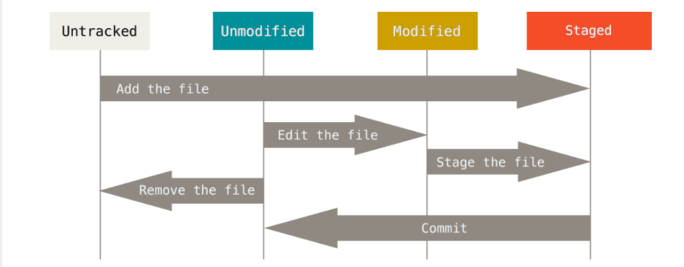

# git and github

## basic information of git

git is a distributed version control system as opposed to centralized version control system  
git makes every developers' computer contains the whole history (git保存的代码版本，存放在本电脑中，而不是远程服务器  
and centralized version control system makes the history stores in a remote server

we will call the entire history of the whole project "repository"

## basic git command

```java
git init
git add
git commit
git log
git status
git show
git checkout
```

if you want to use checkout command, you would better choose **one folder or file.**

when we initialize a git repository, we will create a '.git' subdirectory in it.  
this subdirectory will contain **a brunch of metadata**, and we will never directly open it.

​​

we can use command "git status" to check the status of each file

git add 用来把指定文件添加到下一次要提交的内容中  
git commit 把要提交的东西保存下来，并且添加说明

```java
git add FILENAME
git commit -m "说明"
```

git log is a good way to view commit history

**undoing changes 撤销更改**

We can use the command `git reset FILENAME`​ to take the file status back to the modified.

## remote repository

how to connect with your own repository

1. 我们需要把本地的git仓库和我们建立的GitHub仓库远程链接
2. 我们GitHub账号需要链接上本地git账号的rsa密钥
3. 本地git 进行各种处理之后，可以push给GitHub了  git push origin master 这是直接传递给主枝干的命令

## git branch

Former action we mentioned is all in the master branch. Although we can iterated many version of the master branch, it still have limited function.

And branching allows our program having multiple dimensions. Each time you want to make a dramatic change to your code or you just don't want to mix you work up or you may have several opinion and you don't which one will works, you can choose to make a branch.

**basic command of git branching**

```java
git branch BRANCH_NAME //create a new branch
git checkout BRANCH_NAME //switch from one branch to another

git checkout -b BRANCH_NAME //create a new branch and turn into it
git branch -d BRANCH_NAME   //delete one branch
```

**Note:**  it is advised that you should use the default "master" branch as your main branch.

**branch merging**

```java
git checkout master
git merge BRANCH_NAME
```

These two commands will delete the branch and merge it into master.
