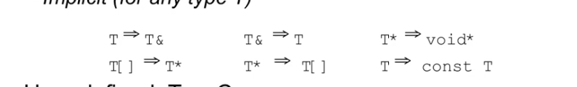

# C++ note
!!! note "C++学习笔记"
	学习翁恺老师的oop和暄暄学长的网课中写的笔记，可能存在一定的错误以及和暄暄的笔记重复的地方

## C++ 类

### 类的声明与定义

类声明之后，可以做一些事情，例如定义指向它的指针  
但类在被定义之前，都不能去定义变量（包括成员变量），作为函数声明的参数和返回值

```cpp
class X;//声明
X* p; //可行
X* func(); //可行
```

不允许在类的成员变量中定义这个类的变量，因为此时这个类还属于未定义完全的类

```cpp
class test{
 test t; //报错
}
```

什么算是完整定义的类，类的声明和定义

### encapsulation

#### public private protected

protected 意味着只有自己的子类 子孙类可以访问的数据

private是只有自己可以访问的数据和函数 它们只有这个类的其他成员函数可以访问  
只要是在成员函数里面（参数不算在成员函数里面），无论什么情况下都可以做如此访问  
仅在编译是检查  
C++的oop特性仅存在于源代码级别，**封装性在经过编译器之后就不复存在了**

```cpp
class A{
private :
	int a;
public :
	void g(A *q){ this->a = q->a};//此处即是在一个类的成员函数里面，
				      //调用了任意一个对象的的私有成员
};
```

All data member in the class should be declared by private.

#### friend 

设计为friend的类 函数 或是某个类里的某个函数，可以去调用这个类的私有成员，这个friend需要被声明在public中  
friend 是要**被调用私有成员**的类去说明的

Here is an example of friend function to access the private member.

```cpp
class testOfFriend{
private:
		int x;
public:
	friend void func(const testOfFriend& a);
}

void func(const testOfFriend& a){
		cout<<a.x<<endl;
}
```

And we provide a more practical example

例如我们有一个类表示矩阵matrix  
那么矩阵的数乘运算我们知道，常见会有int**matrix的情况，于是我们需要运算符重载函数，由于是int*matrix，所以该运算符重载不能作为matrix类的*  
一部分存在，而必须是一个全局的方法，但是在这个运算符重载函数中，我们又必须要访问matrix里的每一个元素，也即matrix的私有成员，因此我们可以选择  
在matrix类中，将这个运算符重载函数，声明为friend。However we have better way as below, and we should avoid to use friend because it is a bisruption to the encapsulation

```cpp
//但事实上更好的解决方法应该是这样的
Matrix operator*(int n,Matrix mat){
	return mar*n;
}
//通过换壳，来避免了友元类型的使用
```

Here is a strange to express the friend class to use the private member.

```cpp
//此处的例子很怪异
//特别的 为了编译要通过
class X;//这里是为了在Y中定义该函数时不报错
class Y{
public:
	void f(X*);//这里是为了在下面X中加入friend不报错
};

class X{
private :
	int i;
public :
	void initial();
	friend void g(X*,int);//这个函数可以调用X里的私有成员
	friend void Y::f(X*);//Y类里面的函数可以调用X里的私有成员
	friend class Z;
	friend void h();
};
```

### initializer list 

一种常用的在构造函数中初始化变量的方法。

```cpp
class point{
private :
	int a;
	int b;
public :
	point():a(0),b(0){}
};
```

这个行为会早于构造函数里的内容被执行  
当类的成员是对象时，这个操作就有意义了 **构造函数里是赋值 initializer list是初始化，这是一种初始化器**  
构造函数的作用在于初始化所有类中的成员 但是实际上如果在构造函数的大括号里头写的话其实是初始化再赋值，一旦有类成员是对象，那么它要么拥有默认构造函数，要么它在初始化列表里被初始化。

```cpp
//一个合适的使用初始化列表的例子
class User{
private:
	int id,age,failTimes;
	char* password;
public:
	User(int id,int age,char* pw):id(id),age(age),failTimes(0),password(copystr(pw)){}
};
```

**类里的所有成员变量都应该用initializer list的初始化**

其中如果一些有自定义构造函数的对象作为成员变量的话，不使用initializer list 就会报错。

使用初始化列表有一些需要注意的内容：  
如果构造函数的声明和定义分离了，初始化列表应当用在构造函数的定义上  
初始化列表不影响初始化顺序，所有的成员函数的初始化顺序是其在类中定义的顺序

initializer list使用的必要条件之一为对于没有default constructor 的成员变量，必需依赖initializer list进行初始化。

### default member initializer

default member initializer

C++中支持在写类的定义中，给成员变量一个默认的值

```cpp
class User{
 int failtimes=0;//这就是一个default member initialzer
 ...
};
```

有一点需要注意，如果这个成员变量是一个对象的话,c++不允许以Point c(0,0); （也许是因为这样太像函数了？）的形式对其进行初始化操作  
必须写成这个样子Point c=Point(0,0);

### special member function

在c++的类中存在四种特殊的成员函数，分别是构造函数，析构函数，拷贝构造函数和拷贝赋值运算符（operator=）  
它们有一个共同的特点就是所有的类都有默认的内置的函数存在，可以通过显式的声明去删除或者使用这些default function

#### 构造函数和析构函数

constructor 

```cpp
class A{
   public :
	A();
   private :
	int i;
};
A::A(){
    i=0;
}

//带参数的构造函数
class B{
   public :
	B(int k);
   private :
	int i;
};
B::B(int k){
	i=k;
}

//无参构造函数对象的创建
A a;
//带参数构造函数对象的创建
B b(10);
```

对于构造函数的正确理解：classA a=classA();  
相对于function而言，classA（）这样的构造函数更加贴近于类型转换符号

default constructor 是指所有的**可以无参调用的构造函数**，包括编译器给的和你自己写的所有**没有参数**的构造函数以及有**所有参数都有默认参数**的函数  
此种构造函数较为特殊  
default constructor比较特殊，一般的构造函数使用时需要有括号，然而default constructor在构造对象时**不能**加括号，加了括号系统会认为这是一个函数

c++支持委托构造函数，delegating constructor  
这是通过初始化列表，把构造工作委托给另一个构造函数的方式

```cpp
struct C{
	C(int){puts('a')};
	C():C(42){puts('b')};//这个函数被称为delegating constructor
};//上述为委托构造函数的例子
```

```cpp
class A;//假设A的构造函数没有参数
A a();//此处的a是一个函数，返回值是A类的对象
A b;//此处是一个变量的构造，构造了一个A类的对象
```

**destructor 析构函数**

析构函数不同于构造函数，析构函数必然是无参函数，因此不存在重载。

析构函数的调用是从下至上的，一般来说晚构造的先析构

```undefined
class Y{
public :
	~Y();//析构函数
private :
	int i;
};
//当程序运行到离开这个对象的作用域之后 系统会调用析构函数
```

For object in function, the destructor will happen at the end of function.

However, if the the object in function is a return value. It may not happen at the end of fucntion. It will behave as a temporary variable and will be destructed  
when the sentence ends.

```cpp
class test{...};
test func(){
	return test();
}
int main(){
	func();
}
```

#### 拷贝构造函数

在c++中要注意初始化和赋值的区别

```cpp
class A;//A中只有一般的构造函数 无拷贝构造函数
void func(A a);

A a;   //构造函数
A b=a; //拷贝运算符重载函数
A c(a); //拷贝构造函数
func(a); //拷贝构造函数
```

在上述代码之中 b的初始化没有经过A类的构造函数 而是直接由a赋值过来  
同样的 当一个对象作为函数的参数 然后实参传入函数中时 也是作为赋值而跳过一般的构造函数

针对此种问题 我们有拷贝构造函数  
**拷贝构造函数的定义 **

它是一个构造函数，并且第一个变量为该类的引用，可以为常量引用也可以是非常量引用，没有其他变量或者其他变量都有default value  
形如 T::T(const T& )   tips：因为如果是T::T(T t)的话，其本身在传参的过程就会发生拷贝构造，会形成无限递归？

c++实际上有默认的拷贝构造函数 我们也可以自己设计  
**默认的拷贝构造函数**做的事成员变量对成员变量的拷贝，  
 **   如果成员变量是对象**，就会调用这个对象的拷贝构造函数member copy  
   这与一般的赋值其实不同 并不是在字节意义上的拷贝  
 **   如果成员变量是指针**, 那么就会发生指针的拷贝 即两个指针指向同一个对象  
   这就会造成一个问题 因为这样之后如果采用一般的析构方法的话 这个对象有可能被释放两次 这也是我们要使用自己的拷贝构造函数的**一大原因，这种情况还包括是一个动态分配的数组的情况**

**拷贝构造函数的应用场景 **

对象作为函数参数时 会跳过自身的构造函数

当成员变量中有动态分配内存的东西时，如果没有自定义拷贝构造，系统默认的那些就会使其指向同一块内存，导致在析构是重复释放内存

要么，在这个类的拷贝构造中去定义好，要么，就是把这些动态分配的内存的成员做成一个类 它们如果有自己的拷贝构造函数，就没有这个问题 典型例子就是动态分配的char *和string的区别 string就不需要拷贝构造函数处理

有的时候编译器会把一些不必要的对象创建过程取消掉，这种情况发生在inline函数时？

所有的类都应该有 constructor, virtual destructor, copy constuctor三个函数

**编译器对拷贝构造的优化**

```cpp
class test{...};
test func(int x){
	return test(x);
}
int main(){
	test mytest(func(1));
}
```

In the code above, we may find it using a complex way to complete a simple action----use 1 to construct a test object.  
If there is no optimizing, we can there is a constructor function and a copy constructor function at least

### inheritance

public, private and protected  
取保护性最高的情况，例如在父类中为protected 用public继承 结果为protected

拿一个类 进行一点修改 创造出一个新的类通过继承 我们可以继承原有的数据成员 原有的函数 interface（接口

继承遵循is_a 原则，子类应当是父类的一种，比如汽车是交通工具；而不是has_a 例如轮子和汽车，汽车有轮子，但是他们不构成继承关系

```cpp
class A{
public:
	A(int k):i(k) {}
	~A(){}
	void print(){cout<<i<<endl;}
	void set(int i){this->i=i;}
private:
	int i;
protected:
	void h() {};//只有自己和子类调用
};
class B: public A{//这一步即表示B是A的子类
public :
 	B b:A(15) {};
	void f() {set(20); print();}//可以直接调用父类的函数
	void g() {i=100;}//此处有问题 父类的私有成员 存在于子类中但是无法直接使用  可以通过调用父类的方法来操作
	void hh() {h()};
};
int main(){
	B b;//会调用A的构造函数
	b.set(10);
	b.print;
	b.f();
};

```

oop的原则在于 private里依旧应该包含所有的数据 protected里面也不应该出现int float等数据

在本质上而言，子类对象包含父类对象，因此其必须在初始化列表里初始化父类对象（或者父类对象有默认的构造函数

先构造父类 再构造子类  先析构子类 再析构父类

C++的特殊设计 对于父类中的重载函数 只要子类中有一个重名的存在 则 子类中这个重名的函数会覆盖所有的重名的重载函数

```cpp
class A{
public :
	void print(int i){cout<<i;}
	void print() {cout<<1111<<endl;}
};
class B :public A{
public :
	void print (double i){cout << i  << endl;}
};
//此时B中仅有这么一个print函数
//如果要调用父类的
int main(){
	B b;
	b.A::print();
}
```

B和A中可以有同名的变量，但其实是不同的变量

```c
class A{protected: int i;}
class B:public A{protected: int i;}
//B size is 8
```

### polymorphism

virtual 关键词 在父类中的函数前有virtual 如果子类有同名函数 则这两个函数时有联系的  
子类的同名函数中virtual加不加都可以 加了便于阅读  
例如： 父类中有一个virtual的render函数,就可以写出这样的函数

```cpp
void render(shape *p){
	p->render();
}
//因为向上造型 shape指针其实可以承载shape的每一个子类 也就是说对于每一个shape的子类产生的对象而言 用这个render函数都可以求出它的render
```

多态性基于upcast and dynamic binding（动态绑定）调用那个函数根据对象决定

因为我们使用父类的指针去承载这个对象 因此如果没有virtual关键词 那么同名函数之间就会调用父类的函数

所有有virtual的类最上层都有一个指针 他会比正常的类大一些 会大出多个指针大小的空间 空间大小为虚函数个数乘以指针大小 对于一个类的对象而言 一般的函数不占据空间 但是虚函数一旦存在 会固定占据8个字节的空间  
这是一个指针 指向虚函数表 一个类的所有对象的虚函数表是同一个 虚函数表的大小与虚函数个数有关  
进行内存大小分析的时候要注意 类的内存可能会有一些对齐原则

但是对于父类和子类而言 他们的vtable（虚函数表）是不同的 他们的虚函数表指的是各自的虚函数  结构是基本一样的 但是函数本身是自己的函数 子类的vtable里面是子类的函数，当然如果子类没有 那么依旧沿用父类的虚函数（说明该子类没有对父类的这个方法进行多态）同时如果子类本身又创造了虚函数 为了创建子类的子类的话 新的虚函数会在原有的虚函数下面 原有的虚函数依旧保持着原有的顺序

```cpp
//特殊操作
A a;
int *p=(int *)&a; 
//用这种方式可以对对象的内容进行一定的分析
//会截取这个对象中前int大小的内容


class A{
public :
    A():a(0),b(0) {}
    virtual void print();
    virtual void myprint();
private:
    int a;
    int b;
};
void A::myprint(){
    cout<<"111"<<endl;
}
void A::print(){
    cout<<a<<b<<endl;
}
//sizeof A的对象 大小为16
//sizeof 
```

类之间的成员类型转换：

当我们使用向上造型时依靠的都是指针 当我们想要实现动态绑定是也依靠的是指针 如果没有指针 而是单纯通过a=b来实现用A类对象承接B类对象 那么虚函数实现的多态就会失效，这个a只能调用父类里的函数 只有通过指针去调用虚函数才会是动态绑定 赋值传递的虚函数指针不传递？

我们需要析构函数时virtual 原则上 如果一个类里有虚函数 则这个类的析构函数必须是virtual的 。 目的是应对以下情况：

```cpp
A *p=new B();
delete p;
//A类为父类 B类为A类的子类
//此时如果A的析构函数不是virtual 那么在delete的时候调用的就不会是B的析构函数
//而是调用的A的析构函数
```

overridding

对于子类和父类的两个函数 如果均为virtual而且函数名相同  参数表也相同 那么记为它们两个是overridding的

在子类中想要调用父类的函数 可以使用Base::的写法

对于一个虚函数而言 在子类之中可以返回子类的对象的指针 也可以返回子类对象的引用 但是不能返回子类对象本身

虚函数的覆盖问题

前文中有提到一个子类的同名函数会覆盖父类里面所有overload的函数 在虚函数中也是如此 如果父类里有两个同名不同参的虚函数 然后子类里面只有一个同名的虚函数，也会构成覆盖所有的关系， 因此如果要实现好 每一个overload的虚函数都要在子类中写出其对应的函数 否则会无法正确地继承下来

## STL

### basic imformation of STL

标准模板库 主要用到了泛型编程的思想，与oop存在不同

stl有六大部件  
container容器  容器会是一个class  
allocator分配器 帮助容器分配内存  
algorithm算法  对容器中的数据进行操作 与oo不同的是，操作和不在容器中  
iterator迭代器 类似于一种泛化的指针，用于联系算法和容器  
adapter适配 用于转换一些东西 容器，迭代器，仿函数  
functor仿函式 作用像一个函数

s.begin() 指向第一个元素  
s.end() 指向最后一个元素后面那一块

```undefined
//遍历整个容器
//每个容器都有对应的迭代器
container<T> c;
container<T>::iterator ite=c.begin();
for(;ite!=c.end();++ite){...}

//新特性的遍历方法
for(decl:coll){...}
vector<double> vec;
for(auto elem:vec){cout<<elem<<endl;}
for(auto &elem:vec){elem*=3;}
for(auto i:{1,2,3,5,4,8,5,2}){...}

//auto指针再使用
list<string>::iterator ite=::find(c.begin(),c.end(),target);
auto ite=::...//前面可以直接改写为auto
```

#### container 

c++标准模板库里的container基本可以分为两种，sequence container and associate container 线性容器以及关联性容器

sequence container 包括vector（可变数组） array（数组包装成的class，性质和C原有的数组是类似的） deque（双队列，两端都是可进可出） list（双向链表） forward-list（单向链表）  
associate container including set（红黑树）, map（红黑树，每个结点都有一个key和一个value组成）,multiset（元素可以重复）,multimap(一个key可以对应多个value), hash_table unordered set（散列表）, unordered map（散列表）

#### allocator

int func(int x=5);

int func();

目的就是在于不要让使用STL的用户不要直接接触内存  
一般来说对于用户是没有必要使用的  
最终还是归于malloc malloc给的东西比所需的size要大，对于c++而言，operator new会去调用malloc，当然在不同平台调用方式未必相同

```undefined
template<typename_Tp,typename_Alloc=std::allocator<_Tp>>
 class vector::protected_Vector_base<_Tp,Alloc>
```

但是我们也可以自行使用我们想用的alloc

现行使用的allocator 都不仅仅是对new和delete进行封装，而是一个多层次的空间分配系统。

**一般的内存分配：**

```cpp
class Foo{...};
Foo temp=new Foo;  //new一块内存，然后调用构造函数
delete temp;		//调用析构函数，并且delete内存
```

在C++的STL中会把上述的四个部分分开来

1. 构造和析构交给 construct() 和 destroy()
2. 空间分配交给 allocate 和 deallocate

**note：** 为什么不直接调用构造函数和析构函数进行构造和析构，STL为了提升效率，会检测该次析构是否是有效，如果并非是重要的析构，可能会将其省去。

 ** std:: alloc**

对于STL内部的空间分配器，我们需要考虑

1. 向heap要空间
2. 多线程（这里暂时不考虑
3. 内存不足时的处理
4. 内存碎片的处理

alloc在内部使用malloc和free来操控内存，设计双层配置器，对于内存的申请，当配置区块是128bytes 视为足够大，直接使用一级配置器，小于128bytes时视作过小，使用memory pool进行整理

值得注意的是双层配置器alloc是不符合STL的分配器的标准的，因此会对齐进行一定的封装，使其符合标准接口。封装里没有什么值得细说的，都是直接转调用。

* 一级配置器见P90
* 二级配置器见P94

#### iterator

It is one kind of the class template which overloads the operator* operator++ operator->

**iterator and algorithm**

```undefined
::sort(c.begin(),c.end());
```

generic programming 把数据和方法分开来，那么要想把container和algorithm联系在一起，就需要iterator迭代器  
在上述例子中，sort并不封装在 vector,deque 等容器中，他们自身也没有自己的sort函数，因此只能用他们的迭代器去加入sort

优势在于只要好好利用模板和操作符重载，算法方面就可以闭门造句bushi

但是当操作符重载也无法将其实现算法复用的时候，或者说这个容器的特性使得其有优秀很多的算法的时候，就会在容器内部内置一个算法  
比如list的sort list提供的迭代器有一定的条件，因此无法使用全局的sort

### some definitions in STL

#### std::size_t

```cpp
typedef unsigned_int size_t
```

是一个无符号整数，作为sizeof运算符的返回值，本质上就当一个无符号数使用就好，但是当我们要表示字段的长度的时候，最好使用size_t代替int

#### std::ptrdiff_t

​`typedef long signed_int ptrdiff_t`​ 是有符号常整形，用来表示指针的减法结果

### iteration

迭代器是一种类似于指针的对象，它最基础的功能就是对`operator* and operator->`​进行重载。

对于这一点，C++提供的库里面有一个类似的东西 `auto_ptr`​ 主要用来防止使用原生指针带来的内存漏洞

```c
//auto_ptr 的使用方法
auto_ptr<string> ps(new string("hello"));
```

迭代器在容器和算法之间充当粘合剂的作用。

**泛型思想**

想要让迭代器代替指针做所做的工作我们还需要一些其他的内容。

当我们使用一个int指针的时候，我们可以很轻松地做这样的工作

```cpp
int* x;
int y=5;
*x=y;
```

因为我们很容易得知道int* 指代的对象是int

但是在泛型之中，我们很难以知道以如下形式被传入的迭代器所指的对象类型是什么

```cpp
template<class I>
void func(I itor){...}
```

因此我们的操作就会受到限制

**如何获取迭代器所指对象的类型**

```cpp
template<class I,class T>
void func_real(I itor,T item){
	T object_we_need;
	//...
}
template<class I>
void func(I itor){
	func_real(itor, *itor);
}
```

利用编译器会自动推导泛型的类型的性质，把原本要在func里做的工作嫁接到func_real 上

但是仅仅如上的操作是不足够支撑迭代器去取代指针的。这个T作为func函数的返回值就会出现问题

**partial specialization**

对于一个泛型类或函数而言我们可以对其进行一个特化

```cpp
template<class T>
class A{...}
template<class T>
class A<T*> {...}  //当且仅当T为原生指针时
```

**由这项特性，我们衍生出一项操作**

```cpp
template<class I>
struct iterator_traits{
	typedef typename I::value_type value_type;
};
```

其意思为如果I类型有定义value_type 我们可以通过其“萃取”出value_type

其可以应用在对迭代器的操作中，例如

```cpp
template<class I>
typename iterator_traits<I>::value_type func(I itor){
	return *itor;
}
```

上面有个很长的式子用来表示函数的返回值，意思是如果I存在value_type的定义，那么就依赖I的value_type的定义作为函数的返回值  
有效解决了我们在使用泛型的时候，无法访问迭代器所指向内容的困境。

更好的是，该情况能够兼容原生指针

```cpp
template<class I>
struct iterator_traits<I*>{
	typedef I value_type;
};
```

上述版本是一个partial specialization的版本，意思是如果（I*）是个原生指针，那么直接将I作为value_type

要使得我们的迭代器在泛型条件下正常工作，我们需要定义五个相应类型

```cpp
value_type;  //迭代器指向对象的类型
difference_type;
pointer;
reference;
iterator_category;
```

**difference type**

表示迭代器之间的距离

**reference type**

顾名思义是和reference有关的类型

对于不是const的指针，我们应当可以改变其所指向的对象的内容，此时其operator* 所返回的对象就应当可以做左值  
所以其应当返回 该指针指向对象的reference type；

```cpp
```

### string

字符串的运算符重载

子字符串查找，截取，替换

to_string();

### array

array是c++11针对原有的数组进行了容器化的操作产生的新的容器类型，其本身

**构造函数**

```undefined
array<数据类型,长度> arr={1,2,3,4...};
长度和内置的数组一样，必须是一个常数
```

**迭代器返回**

```undefined
arr.begin()//返回第一个元素的迭代器
arr.end()
arr.cbegin();//返回第一个元素的const的迭代器
arr.cend();

```

**方法**

```undefined
arr.size();
arr.max_size();
arr.empty();//如名字所示
arr.fill()//设置所有元素的值 arr.fill(5)是指将所有元素赋值为5
arr.swap(); //交换容器的内容 使用方式arr.swap(arr1) 交换双方的全部数值，
并且双方的array必须拥有相同的长度和相同的数据类型
```

**数据访问**

```undefined
arr[2];
arr.at(2);/返回第二个元素的引用
arr.front();//返回第一个元素的引用
arr.back();//返回最后一个元素的引用
arr.data();//返回第一个元素的指针
```

‍

### string

substr()

### stack

```undefined
stack<int> myst;
myst.pop();
myst.push();
myst.top();
myst.empty();
myst.size();
```

### vector

**构造方法**

```undefined
vector<int> a(10);//a会有10个元素，但每一个元素的初始值不确定
vector<int> a={1,2,3,54,8,565,62,1,8,8};
vector<int> a(10,1);//a有十个元素，且均为1
vector<int> a(b);//b为一vector a与b完全相同
vector<int> a(b.begin(),b.begin()+5);//a的内容为b的前五个数据
vector<int> a(b,b+7);//a的内容为b的前七个数据，b为数组
```

**迭代器**

```undefined
vec.begin()
vec.end()
vec.cbegin()
vec.cend()

```

**操作方法**

vector 的push_back()需要扩张空间的时候，一般的做法是两倍扩大

```undefined
vec.size()//有多少个元素
vec.max_size()//整个系统能给我们的vector多少空间


vec.resize(n)//将vector里的size修改为n，这里有三种情况
//如果n小于原有的size(),那么后序的数据将会被销毁，但是vector本身的capacity不变
//如果n大于原有的size()但是小于原先的capacity，会新增加元素，新增的元素都是0
//如果n大于原有的capacity，那么size和capacity都会变为n，新增加的元素均为0


vec.empty()//空则返回0
vec.shrink_to_fit()//去除预留的空间，使得capacity和size保持一致
vec.capacity()//目前空间有多大

vec.erase(迭代器) 删除这个位置上的数据
返回下一个有效的迭代器
vec.erase(迭代器1，迭代器2) 删除迭代器1到迭代器2的所有数据
vec.push_back()
vec.pop_back()
vec.insert();
vec.assign()
vec.swap()
vec.clear()
vec.emplace()
vec.emplace_back()//其效果与push_back一样，但是实现方式不同
```

using insert

```cpp
// method1
vector<int> vec1;
int arr[] = { 1,2,3,4,5 };
vec1.insert(vec1.begin(), arr, arr + 5);     //[1,2,3,4,5]

// method2
vector<int> vec2(vec1); 
vector<int>::iterator it = vec1.begin() + 2;
vec1.insert(it, 3, 20);                      // [1,2,20,20,20,3,4,5]

// method3
vector<int> vec3(3, 40);
vector<int>::iterator it2 = vec2.begin();
vec2.insert(it2, vec3.begin(), vec3.end());  // [40,40,40,1,2,3,4,5]

```

**构造函数**

**迭代器**

**方法**

```undefined
list1.sort();//这不是全局的sort，而是list私有的sort
```

**构造函数**

**迭代器**

**方法**

双边可进可出的数组 vector的进阶版？ 本身的数据组织形式类似与vector

其本身的数据组织是分段连续的，分成了很多段，每段自身是连续的，但是段与段之间是不连续，但是在实际使用过程中还是看做是连续的形式去使用  
本身是一个数组，数组成员的指针去指向那每一段的数据

deque的功能其实涵盖了stack以及queue，因此stack和queue在底层都是使用deque作为实现方法  
很多时候也不把stack和queue叫做容器，因为其本身都是依赖于deque的，所以也把他们叫做adapter，因此stack和queue不会给出迭代器

```undefined
//deque的主要操作
deque<int> mydeq;
mydeq.push_front();
mydeq.push_back();
mydeq.pop_front();
mydeq.pop_back();
mydeq.erase(迭代器);
mydeq.erase(迭代器1,迭代器2);
```

```undefined
pop没有返回值？
```

‍

‍

底层实现是红黑树

构造

unordered_set<int> se;

底层实现也是红黑树，只是里面是一个key 一个value

**操作**

```undefined
mymap.insert(pair<type1,type2>(key,value))
auto item=mymap.find(target);
cout<<item.first<<' '<<item.second<<endl;//first 给出的key second 给出的value
multimap,不可以用下标运算符作为insert
mymap[i]=n; 是不可以的
```

底层实现是散列表

散列表里面每一个地方会挂数量不定的元素，但是其bucket的数量一定多于其本身承载的数据的数量，也就是说明其中是有很多bucket是没有承载元素的  
其内部扩充的方法也是两倍式扩充

**操作**

```undefined
mset.insert(元素);
```

底部依旧是红黑树

内部元素不能重复 key不能重复，key和value是相同的

内部元素不能重复 key不能重复 value可以重复

```undefined
mymap[i]=value; 可以用此种做法去做insert功能
```

## C++动态内存分配 new and delete

new int  ;  new int[10]  
int *myarray =new int [10]  
Student *q=new student();

```undefined
Student *r = new Student [10]; //申请了十个student对象
//delete r;
delete [] r;
```

delete有两种 一种是delete 一种是delete[] 一般如果在new的时候带了[] 那么delete的时候也一般要带上[] 对于c++而言本身就是一种调用各种对象的析构的一种方式，int char这些最基础的东西也是有析构的 加[]就表示这个东西它本身有很多对象在一块，需要一个个调用析构函数  
一个个调用析构函数时从后往前析构

```undefined
int *a = new int[10];
a++;
delete [] a;//此时就会出现运行的错误 任何动态分配的对象与其对应的内存之间
//都会有一个对应的表格，如果其本身发生改变，就无法通过这个表格找到其对应的内存

//同时C++允许delete null的指针
int *p=0;
delete p; //是不会报错的，其余情况下，delete只能对new出来的空间进行操作
```

类的析构函数，要把在类运行过程中new出来的空间要delete掉

```undefined
//一般会这样操作
class A{
private :
	int *p;
public :
	A(){p=0;}//至少保证p是0，这样如果在没被new的情况下一样可以被delete
	~A(){if(p) delete p;}//最好还是加一层保险
};
```

## 标准库函数

reverse()  
可用于旋转字符串 reverse(s.begin(),s.end())

assert(条件)这个条件为假，则程序退出？

sort 排序算法 sort（c.begin(),c.end()）

```undefined
sort(迭代器1，迭代器2,judge function) 返回void
sort(vec.begin(),vec.end(),greater<int>())
```

‍

count_if(迭代器，迭代器，条件) predicate，是一种判断工具，会传回真或假

```undefined
count_if(vi.begin(),vi.end(), not1(bind2nd(less<int>(), 40)))
```

find 函数

```undefined
find(迭代器1,迭代器2,target) //返回一个迭代器，建议是用auto去接收
```

## C++特性

### inline function

inline function is called function-like macros 类似于**宏函数**的一种函数

去调用一个函数 不论函数多简单 都要进行一系列**额外的开销工作**：把参数压入 把返回地址压入 准备好返回值 最终把压入的出栈

为此我们使用 inline function 内联函数

不是去调用函数 而是直接把函数代码嵌入调用的地方。就像宏函数的使用方式一样

对于类型检查是编译时做的 inline 函数处理的是运行时的额外开销，类型检查和一般函数还是一样的  
使用inline函数时有以下要求

```undefined
//必须在函数原型和函数定义中都加上inline 关键字
//.h和.cpp中都要加inline
inline int plusone(int x);
inline int plusone(int x) {return ++x;}
//inline 函数的特殊性在于 其本身看起来的定义其实是一个声明 如第四行的这个其实是一个声明
//因此在多数情况下使用inline时 直接在.h文件中写在这个完整形式就好
```

相比于C语言的宏而言 宏函数不能做**类型检查** 而inline函数可以，因此inline function是宏的优秀替代

递归函数不可以做inline，代码量很大的函数也不值得做inline，从汇编指令中可以看出，代码本身也是一条条写在内存中的，过于冗长的代码会造成内存紧张等一系列问题  
在现代编译器中，编译器会**自动判断**这个函数是否值得做出inline，不再需要我们去手动添加inline关键词了

inline函数 作为成员函数 **在类中直接定义写出来的函数** 都是inline函数 目前inline关键词的实际用处在于构建仅有.h没有.cpp的库  
短小的并且在循环中反复多次调用的函数 值得做出inline

```undefined
class A{
public :
	void print(){cout<<endl;}//这个函数默认为inline函数 加上inline关键词也不会错
	void change();
private:
	int i;
}
inline void A:: change(){
	i++;
}

//在声明中写定义的行为有inline的属性  class 本身只是一个声明 如果在里面写了函数的定义 则这个函数为inline函数？
```

### const *

1. const int i=3; 这个i不能被后续修改，即便是把其修改为3，对于这样的i，必须被初始化，指向其的指针也必须是**常量指针**，如2中的两种 3中不行
2. const int * p=&i;  int const* p=&i;  表示指针可以被修改，但是指针所指向的那个i的内容是不能被修改的。他们可以指向非const的i ？？
3. int * const p=&i;  表示i的内容可以修改，但是p本身不能被修改，一定是指向i
4. const int * const p=&i;  i的内容和p的内容都不能修改
5. void func(const int *x)   在此函数中不会对x所指向的对象做出改变，更常用void func(const int &x)  
    在此种情况下，这个x只能调用如7中定义的函数
6. const int func(int x) 只能赋值给const int的变量
7. void Class::func(int x) const {...} 我们都知道类的成员函数有this指针的存在，但是因为this是隐式存在的，因此特别的在后面加一个const，表示对this进行const约束，这个const在定义和声明的时候都需要加
8. const 去确定数组的大小，它必须被初始化，并且是被常量如100这种初始化。
9. 字面量字符串的const属性？ 可以赋值给非常量字符指针，但是会warning

const 变量 仍然是一个变量 虽然其不发生改变 也与152这种常数存在本质区别

const int和int 不是相同的类型  普通int 可以传给const int 但是

```cpp
const int bufsize=1024;
extern const int bufsize;//这句话的意思是，我们声明有一个bufsize的变量 然后它是一个常量 即编译中会确保其不被改变
						 //对于这样一个bufsize而言 可以用其去作为数组长度
int a[bufsize];
//但不能做这样的操作
int x;
cin>>x;
const int m=x;
int n[m];
//上述做法是错误的 必须保证编译的时候知道m的值 一般的const的定义 在编译的时候会知道其值 来确定后续有没有对其做出改变
```

对于一个对象作为函数参数时，为了避免巨大的拷贝开销，一般会传入一个地址，当地址传入时使用const 可以避免对象在函数中被修改

如果我们对一个对象前加上const 则说明对象里面的数据都不能被修改  
但是我们对于其中函数需要做一些准备 当我们在函数名后面加上const的时候 即是说明这个函数一定不会修改对象中的数据

```cpp
int Data::expressday(int d) const{
		cout<<d<<endl;
		return d; 
}
//这个函数中不会修改data这个类的对象中的任何数据
//在原型和定义的时候都要加上这个const
int expressday(int d) const;
```

**隐式const的重载**

```cpp
class A{
private :
	int i;
public:
	A():i(1){}
	void f() {cout<<"f"<<endl;}
	void f() const {cout<<"ff"<<endl;}
};
//这是可以编译通过的
//这里构成了函数的overload
//实际上如下
void f(A *this);
void f(const A* this);
//第二个f专门处理那些const的A类对象
```

const 修饰的成员变量必须初始化

```cpp
//如果有以下情况出现
class A{
		const int a;
};
//这个a必须要被初始化
```

### 函数重载 overload

function overloading 

若两个函数名称相同 **参数表不同** 则可以重名 构成重载关系  但是如果只时返回值不同 但是参数表和函数名均相同 无法构成函数重载  
函数重载的意义在于编译器通过不同的参数输入，来决定使用哪种函数形式，妥善使用可以减少很多内耗

```cpp
//基本所有函数都支持重载
double ads(double);
int ads(int);
```

default arguments （缺省参数值）你可以在函数的参数表里预先给一个值 这个功能的使用有以下要求  
原则在于先写原型 再写定义，缺省的参数值使用的原则在于一旦**有一个参数有了默认参数值之后，后面所有的参数都必须有默认参数值**  
default arguments 不太安全。

```cpp
int func(int a,int b,int c=0); //default arguments 必须从右边开始存在 如果b有预先赋值 则c一定要有
x=func(1,2);
y=func(1,2,3);
//这都是保证了函数写形参时 一定是从左往右传入的
//default arguments 只能在.h文件里面写 在.cpp文件中不能写

.h:
int dun(int a,int b=0);
.cpp:
int dun(int a,int b){
cout<<a<<b<<endl;
}

//或者在.cpp中先声明原型 再写定义 default arguments 是在编译过程中操作的
.cpp:
int dun(int a,int b=0);
int dun(int a,int b){
cout<<a<<b<<endl;
}
```

编译器处理函数重载的过程叫做重载解析overload resolution  
编译器会收集同一个名字的函数形成可选函数集，然后按照一定规则比较这些函数，当调用一个函数时有一个函数可以**优于其他所有函数的时候**，调用成功；反之则失败

```cpp
void f(long);
void f(float);
f(1.0);//不会出现问题 因为此时float是最佳选择
f(1);//会出现问题，0作为int可以转换为long也可以转换为float，所以两者都不是最佳选择，因此重载选择失败

void ff(int i=1);
void f();
f(1)//不会出现问题
f()//会出现问题，不知道指向哪个
```

在理论上函数重载可以覆盖所有的默认参数的情况，有了函数重载这个特性实际上并不需要默认参数这个特性  
但是因为默认参数出现在前，为了兼容以前的代码，c++仍然保留了默认参数的特性。

### reference 引用 *

**引用必须被初始化**

```cpp
char c;
char &r=c;//这个p就是对c的引用 记这个p为c的refname 别名
```

对p的操作就是对c操作 等号右边就是一个变量 就从简单来说 r就相当于c的一个别名 对r操作就是对c操作

No pointers to reference, we have reference to pointer  离变量近的确定是指针还是引用

```java
int &*p; //error
int *&p; //right
```

const reference，类同const指针，但**不存在第二种形式**

```cpp
const int& z=x;//通过z不能改变x 但是x可以自行改变

int x=10;
const int& y=x;
y++;//这里就会报错

int & const z=x;//不存在这种操作
```

在同一个代码块中给一个别名一般没什么意义，因此引用最常用的地方就在于函数的参数和返回值

**作为函数参数**

```cpp
void f(int &x);      //效果有二：传参效率增加了，函数中对x的改变会影响到实参
void f(const int &x) //只有效果一
```

存在的问题

```cpp
void f(int &x);
//以下的函数调用会出现问题
f(2);
f(x*2);
//若写成const 上述都能成立
void f(const int &x);
```

**作为函数的返回值**

```cpp
double myarray[14];
double &change(int k){
 return myarray[k];
}
int main(){
	double x=change(12);//x赋值为myarray[12]的值
	change(11)=12;//将myarray[11]赋值为12 如果返回值为const double & 此处便不能做如此修改
}
```

对于上述代码而言，该change函数有三种返回值

1. double ，那么该返回值就不能做左值 change(11)=12会报错
2. double &，可以作左值，可以被修改，change(11)=12相当于修改了该array中第11位的数据
3. const double &, 理论上可以做左值，但不能被修改，change(11)=12会报错，当返回对象比较大，但是又不希望它做左值的情况，可以采用这种做法

**c++中最为常用的对象作为函数参数的方法**

```cpp
void func(const string & name);
//传入一个string类的对象 并且是引用的方式所以不会有很大的函数调用消耗
//用了const的关键字保证了在函数内部不会改变对象里面的内容
```

**当对象（非引用，非指针）作为函数的返回值**

```cpp
class A;
A func(){
	A a;
	return a;
}
 int main(){
	func().test();//可以通过这种方式调用类里的函数
	//但是要注意每一个func（）返回的都是新创建的对象
}
```

**引用的重载解析**

```cpp
void func(int x);
void func(int &x);
void func(const int &x);
//对于这三个重载函数，有以下三个参数
func(1);//				 第一种和第三种为第一优先级 
func(x);//int x=1;  	 这三种优先级相同
func(r);//const int r=1; 第一种和第三种为第一优先级
```

只有当传入的实参只有一个第一优先级的时候，才不会报错

**当引用作为类的成员的时候**

必须有初始值，或者在初始化列表里被初始化

**常量引用**

理论上来说，引用是封装后的指针，所以其所表示的对象一定是有地址的

```cpp
const int& m=1; //这是合法的
```

在实际实现中，这个表达式中出现了一个临时变量，由1创造。这里可以再给出一个例子

```cpp
class A{
private: 
   int i;
public:
    A(int i):i(i){cout<<"cotor"<<endl;}
};
int main(){
    const A& i=1;
}
// 编译成功，输出cotor
```

‍

### 内存对齐规则？

在一个类的对象中 存在着一定的规则

```undefined
class A{
public :
    A():a(0){}
    virtual void print();
    virtual void myprint(){
        cout<<"11"<<endl;
    }
private:
    int a;
};

class B{
 int a;
};
//如上有两个类 其中A类对象的sizeof是16 B类对象的sizeof是4
//虚函数的表vtable本来应该只占据8个字节 但是由于8字节大于此电脑中的int的4字节
//发生了内存的补齐 又补了一个4字节大小的东西使得A类对象的sizeof达到了16

//效果类似于
struct A{
int a;
double b;
} 
//其sizeof是16 而非12
```

### static and 全局变量

static在c中有如下释义，一个是用在函数和全局变量前，表示其不能在其他文件里被使用  
但是其在本文件中处处可以访问  
另一个是用在函数里，将一个变量的生命周期变成全局变量，但是只能在这个函数里使用  
extern 可以引用没有static的其他文件的变量和函数 在linker中检查

在c++中 有static的成员变量和static的成员函数

静态的成员函数只能访问静态的成员变量

**1.在函数中定义一个静态的对象**

```cpp
class A;
void func(){
	static A my_a(0);
}
//和c类似 这个my_a是一个全局变量 仅在第一次进入该函数的时候被初始化
```

对于一个全局的变量 内存分配是在link的时候？  
c++如何去判断这个静态对象是否是被初始化过 对于一个上述的在函数中的静态的  
对象来说，需要能够判断，才能确定在进入这个函数时是否调用构造，结束时是否调用析构函数（有可能是条件定义）

**2.当一个对象作为全局变量时**

其内存的分配和一般的全局变量一样，其构造函数的执行在main函数之前  
因此c++中，main不再是程序员所能控制的第一个函数了（其实不论是c还是c++  
main都不是最先调用的代码）

在同一个文件中，全局的对象的构造函数的从上往下调用的，但是在多文件之间，他们的调用是不存在顺序的，因此如果这些个对象之间有依赖关系的话，需要都放在统一个文件  
中来保证相互之间的顺序

**3.类的成员是静态的**

hidden and persistent  
persistent是指函数之间仍然存在的东西，全局变量和malloc出来的是persistent

在c++中 persistent的成员指的是那些不随着对象而改变的东西  
hidden是依靠public and private来实现的

类中的static成员是不依赖对象而存在的东西 它是对于类而存在的

```cpp
class A{
	static int i;
}
//注意在class中的所有东西都是声明
int A::i;//所以要在一个cpp文件中写出其的定义

//static int A::i;//这种做法是错误的 这是一种把i限制在.cpp的操作
```

对于一个类而言其本身都是声明，最好是在.h里写声明，在.cpp文件里写出其所有的定义，定义包括**函数的定义和静态成员变量的定义，** 如果只有.h，那么类里写的所有函数都是inline函数，且不可能存在静态成员变量（.h里不能放定义

特别注意在静态的成员变量不能在initialize list里**初始化。**   
那么如何对其进行初始化呢，如果其仅是static 那么只能在外部进行初始化  
如果其是const static那么可以直接在类的内部进行初始化

```cpp
class A{
	static int i=20;//error
	const static int p=20;//yes
};

int A::i=20;//此种方法可以对静态成员变量i进行初始化
//当然我们也可以在构造函数内部 用i=2;的方法进行赋值，但这就不属于初始化的范围了
A::A(){i=2};
```

若一个静态成员变量i是一个public 可以通过对象a.i来访问 也可以用A::i类本身来访问它  
如果是private就不能通过这两种方式进行访问

**4.类的成员函数时静态的**

这类成员函数的特殊性在于，不依赖于实例对象，就可以访问静态函数和静态成员，不存在this指针（首先得是public的

this是一个hidden private 但是静态的成员函数时没有this的，因为他不依赖对象

**例如**

这一点在某些场合较为关键，比如我们在sort函数里自定义比较函数的时候，它会检查你的函数的参数个数，此时如果有隐藏的this，那么参数检查可能就会无法通过，需要将其改为static

### overloaded operators 运算符重载

大多数运算符都能被重载 new 和 delete也是运算符  
部分不能重载   .  .*  ::   ?   sizeof  typeid

不能自制运算符，只能对已有的运算符进行重载，并且运算符**操作个数和优先级**不能改变

运算符的overload一定是针对于对象而言的

其实在c语言中已经存在了运算符重载的端倪了，例如指针p+1时，其实是p+1**sizeof（A） p的类型为A*    又如*同时可以做乘法也可以做取地址运算*

**运算符重载的写法**

const String String:: operator +(const String & that);  
这种写法是作为一个类的成员函数而存在的，因此有一个隐藏的this在里面，所以已经  
满足了+需要的两个参数

const String operator+(const String &r,const String& l);  
这种写法是作为一个全局的函数而存在，因此就需要两个参数

写在类中时函数声明的后面也要加上const 来说明this指针时const的

前后都加上const 后面的const用来保证this指针指向的东西不被修改，前面的const保证返回的结果不做左值

**运算符重载的注意事项**

z=x+y为例 其中x y z均为integer的对象

x是运算符左边的算子，记为receiver，receiver来确定使用哪一个加号，用对象来确认  
使用哪一个重载的运算符

z=x+3 这也是调用重载之后的运算符，并且会将3传入构造函数，使其成员一个对象  
但是这里要注意这个类的**构造函数的参数**，如果需要传入double会将3自动转换成double，但是如果本身需要的int 传入double，就会出现问题，编译器的自动类型转换只能从小的到宽的 如果是double到int的话需要强制类型转换

z=3+y 这里3作为receiver，只能用整数的运算符做加法，除非integer能被转换为int，否则这里就会出问题？ 编译器的操作是从左往右进行的

全局的运算符重载函数一般会被声明被friend，因为此时有一个变量不是this指针了，所以两个变量都可以做构造函数转化为对象，因此z=3+y就是可以实现的了

单目运算符应该做成成员函数  
= （） [] -> 必须做成成员函数

**对于算子来说**

对于不会修改算子的运算符，传入的一定是对象的const的引用 后面加const是this是const  
对于++ --这种会修改的

**对于返回值来说**

要看这个返回值能不能做左值 有const就不能拿来做左值，即便是一个引用？

**prefix ++ and postfix ++**

```undefined
class Integer{
public:
	const Integer& operator++();//prefix ++a
	const Integer operator++(int);//postfix a++这里的int没有实际意义
//只是为了让编译器去区分前置和后置的++
//因为两个式子都是会改变传入对象的，所以没有最后的const
private:
	int i;
}
//实际实现
const Integer& Integer::operator++(){
	(*this)+=1;
	return *this;
}
const Integer Integer::operator++(int){
	Integer old(*this);
	++(*this);
	return old;
}
//实际使用
++x//x.operator++();
x++//x.operator++(0);
```

之所以++a是引用是因为 这个式子本身就是返回a++之后的那个值，所以返回的就是++之后的a，带reference会更加节省

注意，在类中重载了运算符之后，在后面的重载函数中使用那些运算符时要注意有没有被重载，最好能依赖于前面已经重载的运算符

**operator [] overloaded ** 对于表达容器概念的类 需要可以拿来做**左值**

```undefined
class Vector{
public :
	Vector(int size):m_size(size){
	    m_array=new int [size];
	}
	~Vector(){delete m_array;}
	int &operator [](int index){return m_array[index];}
private;
	int m_size;
	int *m_array;
};
```

**operator = overload**

```undefined
class Fi{
public:
	Fi(){}
};
class Fee{
public:
	Fee(int){}
	Fee(const Fi&){}
};
int main(){
	Fee fum=fi;
	fum=fi;//此处fi先依靠其中一个构造函数变成fee类，然后在赋值给fum
}
```

等号的运算符重载较为特殊，一般来说系统会给我们一个默认的，做成员之间的等号  
这一点在一些情况下得以表现，如果一个类的成员是一个对象，然后这类使用系统默认  
的等号，在这个类的对象之间使用等号时，会调用它的成员的重载等号

A& operator=(const A&that){  
	if(this!=&that){  
	do assignment  
	}  
	return *this  
}

为何需要这个this和that的判断 因为如果对象中存在动态分配的指针的话，势必我们在  
做等号运算a=b之前，需要delete掉a里头的指针所指向的空间，但是如果a和b完全相同  
那么delete a里头指针所指向的空间就相当于delete b里头的空间，当我们需要使用b的  
那块指针时就会出现问题

有动态分配内存的，一定要写自己的重载等号

**operator 对象名（）强制类型转换的运算重载**

```undefined
operator double () const;//类中的声明
```

这个重载函数比较特殊，前面没有返回类型，他的数据名或者对象名已经说明了  
其需要返回的类型了

‍

‍

### 对象之间的类型转换

value class : Complex Date String

在传递参数时发生的类型转换

```undefined
class A{
public:
	A(){}
};
class B{
public:
	B(const A&){}
};
void f(B){}
//对于一个这样的函数，如果传入的参数是A类的对象，那么就会将其用构造函数
//使其成为B类对象再传去fH函数中
```

explicit关键词

放在构造函数之前，说明这个构造函数只能发挥构造函数的作用，不能像上述代码  
一样发挥自动类型转换的功能  
对于上述代码而言，如果是加了explicit关键字，那么就只能做如下操作f(B(a))来实现  
需要的功能，这个B（）就是创建新的B类对象的意思，并非是强制类型转换

**自动类型转换汇总**

系统已经给出的，其中T可以表示任何类型 T[]表示数组

​​

需要我们自定义的转换  
T可以转换为C类，需要做以下两种操作中的一种

1. C（T）是一个valid constuctor call for C
2. operator C() 在T中被定义

特别地，要注意如果两种情况同时存在时，因为没有优先级，会出现ERROR  
好的解决方法就是在构造函数之前加一个explicit关键字，保证这种方式不再是自动的类型转换  
但是最好不要做这样的自动类型转换，这样当你把不是你本意要传入函数的对象传入时可能会骗过编译器

### template 模板 generic programming

为什么需要模版，如果我们需要一个链表类，int链表和double链表，它们的代码是  
及其相似的，同时只是成员的类型存在差异

模板可以将类型作为参数，我们可以做function template and class template

函数模板 类模板 模板函数 模板类  
类模板做容器  

```cpp
void swap(int &x,int &y){
	int temp=x;
	x=y;
	y=temp;
}
//要将上述函数转换为模板函数
template<class T>
void swap(T& x,T& y){
	T temp=x;
	x=y;
	y=temp;
}
```

template是一个关键字，T是我们常用的表示模版的  
当我们写了这一行template之后，下一行出现的函数或者类就会变为一种模板

**函数模板的具体实现**

这一行template是一个声明，在编译器收到这个声明之后，会将swap给记下来  
当在后面的代码中使用到swap时，会去进行类型的判断，例如遇到了float的swap  
那么编译器会帮我们去做一个float的swap出来，这就是模板真正的定义，因此我们  
的实际代码最后是会有这些个重载的函数的

在上述实现中 如果我们swap一个int double变量，有模板的情况下是不会帮我们做  
自动类型转换 会出现ERROR

实际的运行之中，遇到一个函数，先看看有没有完全匹配的函数，再看有没有模板函数，最后考虑是否可以自动类型转换为非模板的函数

```cpp
int mymax(int a,int b){
    cout<<"mymax"<<endl;
    if(a>b){
        return a;
    }else{
        return b;
    }
}
template<class T>
int mymax(T x,T y){
    cout<<"template"<<endl;
    return 1;
}

int main(){
    mymax(1,2.0);
    mymax(1,1);
    mymax(2.0,2);
    mymax(1.0,1.0);
}
前三个调用的都是非模板函数，最后一个会调用模板函数
```

但是有的时候，我们需要改变的类型并不存在于函数的参数表里面，而是出现在  
函数的内容里，此时就不能简单地通过函数重载来实现，因此我们有其他的方法

```cpp
template<class T>
void f(void){}
int main(){
	f<int>();
	f<double>();
}
//以这种方式调用模板函数则更加地清晰，<>里面即表示我们需要的模板里头的T的类型
//意思就是说f<int>这样写之后，编译器会帮我们做出这样一个函数来
```

**类模板的具体实现**

类模板也是相同的，他本身不作为源文件代码的一部分，但是当有人用到模板时，会根据他给出的类型定义一个类出来  
this process we call it an instantiation

以简单的vector为例

```cpp
template<class T>
class Vector{
public:
	Vector(int);
	~Vector();
	Vector(const Vector&);
	Vector& operator=(const Vector&);
	T& operator[](int);
private:
	T* m_elements;
	int m_size;
};
//对于这个类的函数的书写
//每个函数都必须是函数模板
template<class T>
Vector<T>::Vector(int size):m_size(size){
	m_elemnts=new T[m_size];
}
template <class T>
T& Vector<T>::operator[](int index){
	实际内容
}
//此时在创建对象是
Vector<int> myarray(100);

```

The center of template using is instantiation. However if we only create a pointer for a template class/function, it will not create any instance.  
When this object it points is created, the system would create the instance for us.

```cpp
template<typename T>
class Test{...};
Test<int>* p;
p=new Test<int>;//?
```

We can also use abs<>(1.0) instead of abs<double>(1.0) and here our compiler will guess the type you want. It is called template argument deduction.

一个简单的sort函数的例子

```cpp
template<class T>
void sort(vector<T>& arr){
	const size_t last=arr.size()-1;
	for(int i=0;i<last;i++){
		for(int j=last;i<j;j--){
			if(arr[j]<arr[j-1]){
				swap(arr[j],arr[j-1]);
			}
		}
	}
}
//这个函数的实现需要两个条件
//1.swap函数时函数模板
//2.T这个类型支持<这个符号的比较 也即有运算符重载
```

在出现multiple template时，有时候会出现如下情况  
vector<vector<double> >//>>这个符号左移的位运算，因此在某些编译器中会要求其中间必须有一个空格

还有一些特殊的  
vector<int (*)(vector<double>&,int)>，这个vector的成员是一系列的函数指针  
这些函数指针的参数是一个vector of double 的引用和 一个int

**template的拓展用法**

```cpp
template <class T, int bounds=100>
class fixedvec{
	T element[bounds]
}
fixedvec<int,20> a;
//此时这个bounds即为20
```

template的实际含义是 说明T是一种类型，bounds是一个int 然后如果在定义时不加说明 则bounds等于100  
然后在下面的函数或者类里面可以使用这里面几种声明，其中这个bounds是可以作为  
数组的初始化的T elements[bounds];

**模板可以可以拥有默认参数 template has default parameters**

```cpp
template<typename T,typename B=int> class Foo{...};
// f1和f2实际类型相同
Foo<int,int> f1;
Foo<int> f2;
```

We have know that compiler will guess the your parameter type, so the default parameter of template don't need to be at the end of  
parameter list. (模板的默认参数不必出现在最后

And if there is template function, it has default parameter and compiler guess another type, then argument deduction will be prior.

```cpp
template<typename T=int> void func(T x){...}
int main(){
	double x=1.0;
	func(x); //T is double
}
```

‍

‍

**template and inheritance**  

在模板里出现继承，要清晰，继承依旧是继承的是类而不是模板，  
template<class A>  
class Derived:public list<A>{};

此时这个list<A>仍然是一个具体的类，只是有模板而已

C++如何处理多文件里的模板产生重名的问题，

‍

### some conception I meet creating allocator

#### constexpr and noexcept

constexpr目的在于将运算放在编译阶段而不是运行阶段，可以用来修饰函数和结构体

对于修饰的函数，需要满足以下要求

* 修饰的函数只能包括return 语句。
* 修饰的函数只能引用全局不变常量。
* 修饰的函数只能调用其他constexpr修饰的函数。
* 函数不能为void 类型和，并且prefix operation（v++）不允许出现。

noexcept 是用来说明一个函数不会抛出异常，那么代码在编译时就不会为这个函数产生错误信息的堆栈

#### nodiscard

用[[nodiscard]]去标记一个返回值和一个类，用于说明这个返回值或者类是“不该被舍弃的”，当后续程序调用这个函数，但没有变量去接收  
这个返回值的时候，编译器会给出warning

```cpp
[[nodiscard]] int func(){return 2};
int main(){
	func(); 	  //error
	int n=func(); //right
}
```

### 异常

程序是否正确处理运行时的各种问题，比如调用文件处理函数的时候根据返回值判断是否成功进行文件操作

exception

在文件运行过程中，发生了某些问题，虽然程序本身也许无法处理这个问题（文件打开函数无法处理文件无法打开的问题，但是它可以告诉我们出错了，并且阻止程序继续运行下去），但是要对其做一定的干预，指跳出异常

要有清晰的错误处理代码

以下为一个例子

```undefined
template<class T>
T& vector<T>::operator[](int index);
//数组下标也许会越界，此时我们会使用一个关键字throw
T& vector<T>::operator[](int index){
	if(index<0||index>=m_size){
		throw<<something>>;
	}
	return m_elements[index];
}
```

throw可以抛出任何东西，包括基础数据类型以及对象，一般来说会对于一个类制作一个  
异常的对象

```undefined
class VectorIndexError{
};
//由这个类去判断到底抛出什么错误
//实际使用中
throw VectorIndexError(index);
//用这个index去构造出一个错误对象
```

一共有三种地方存放对象：堆栈，堆，全局数据区

一旦程序执行到throw，会一层一层地返回上去，直到找到一个try可以处理它

try 语句

try{..}  
	catch ...  
	catch...

try后面至少一个catch catch的形式

catch（sometype v）{处理操作}

如果catch括号里面写...的话，那么就可以捕捉到所有的exception  
对于一个异常而言，首先自然是去找有无完全匹配的catch，然后去找有无父类的可以承载子类的catch，再找有无...的匹配所有  
但是注意不是多编扫描，而是从catch从上往下，每个catch按照这三个条件去检查一次

如果catch中把父类写在子类前面，或者把...写在其他前面，编译会报错

```undefined
void abc(int a):throw(aERROR,bERROR){}
//这个含义是指abc这个函数最多只会抛出这两种异常
void abc(int a):throw(){}
//这里含义是指我承诺不抛出任何异常
```

C++中malloc出现错误是抛出异常

如果一个类的构造函数里抛出了异常，会比较麻烦

### stream 流

缓存区的文件对象

‍

在unix中把所有的外部设备看成文件

C++的用了流  
<< insert 把对象插入流里面  >>extrator 把对象从流里面解析出来  

流的方向不变，一维单方向的  
与c相比，c的文件处理是可以从任意地方开始的

‍

‍

### 仿函数

仿函数是一种特殊的类，特征在于里面重载了（）这个运算符，因此它可以以函数的方式被使用  
这个（）的重载内容便是这个仿函数的主体

但因为它作为类的缘故，它还可以有一些其他的成员变量，使得其使用更加灵活

仿函数的一大用途作用于STL，其可以帮助定义一些用于比较的类，比如在优先队列里面

```cpp
struct AddOffset {
    int offset;
    AddOffset(int _offset): offset(_offset) {}
    int operator()(int val) const {
        return val + offset;
    }
};
 
void add_offset_with_functor(int* input, int* output, int len, int offset) {
    std::transform(input, input + len, output, AddOffset(offset));
}
```

仿函数特殊一点在于，在使用仿函数例如func（）的同时，既是在使用构造函数，也是在使用运算符重载函数？

### 初始化器

cpp中有三种初始化器，初始化与赋值存在本质区别

一种是等于号

```cpp
int i=2;//这是第一种初始化器
int i(2);//这是第二种初始化器
```

### cpp与c不兼容的例子

#### 空指针nullptr

在c中void *可以隐式转换成任何的指针

```cpp
int *p=malloc(sizeof(int));//malloc的返回值是void *，可以直接转换成int *
```

在cpp中不允许这种隐式转换，因此c++不允许使用(void *)0作为空指针，在c++11之前，空指针常量就是值为0的整型量int *p=0;  
但是这样做有一个问题，0被定义为一个空指针常量之前，其首先是是一个整形，只不过能够隐式转换为空指针罢了，看如下例子

```cpp
void f(int *);
void f(int);
f(0);  //面对上述函数重载情况，f（0）还是会选择调用f（int）的内容
//为了让这个函数重载能够成功使用
//c++中定义了一个nullptr，来cover上述情况
f(nullptr)//就会调用第一个函数，并且参数是空指针
```

0和nullptr都是空指针常量

### 临时对象

在很多情况下我们会生成一些临时的对象，例如

```cpp
print(m1-m2);
```

m1和m2都是对象，假设我们自定义这个减号运算符，它是有返回值的，但此时它的返回值并没有东西去接受，有一个函数接受了，之后这个返回值就作为  
临时的变量销毁掉了，期间存在析构函数的调用，其**销毁的时机**在于遇到语句的第一个分号";"时

```cpp
ClassM m=m1-m2;
```

在上述情形下，实际上发生一次构造和一次析构，m1-m2的返回值要去帮助m进行构造，结束之后这个返回的临时对象就析构掉了，这样做无疑是一种浪费

于是我们有

```cpp
const ClassM &m=m1-m2;
```

这样子相当于用一个常量引用，延长了这个临时变量的生命周期  
但是，不可以用non-const reference 去延长临时变量的生命周期

### 命名空间和作用域 namespace and scope

多文件  类型转换和构造函数

int (*test)[10] 和 int *test[10]

One class will create a new scope, and we can define a class in another class.  
It can have the same name with other classes define outside.

```cpp
class Inner{...};
class Outer{
	class Inner{...}; //we can just declare here
	...
	Inner A; //内部
	Outer::Inner B; //内部
	::Inner C;  //全局
}

class Outer::Inner {
	//we can really define the Outer::Inner class here.
}
```

### 隐式类型转换和显示类型转换 implicit conversion and explicit conversion

较大类型转换的部分保留

Here are some examples

```cpp
int i;
i='c';      //implicit conversion
i=(int)'c'; //explicit conversion c-style cast
i=int('c'); //explicit conversion function-style cast
```

Before we have mentioned that constructor function in cpp is more like a function-style cast, now we can see that there are many  
rules of implicit conversion in C, **constructor function will be a part of them**. When we pass paremeters into function, they will use their constructor function.

```cpp
void func(classA a);
int main(){
	func(1); //classA a=classA(1);
}
```

If we don't want this constructor happened implicitly, we can use keyword **explicit**

```cpp
class classA{
private:
	int x;
public:
	explicit classA(int i):x(i){}
};
void func(classA a);
int main(){
	func(1); //error
	classA a=1; //error
}
```

There also are some differences in constructor function and stanard conversion. We call the constructor function user-define conversion. When the type conversion happens, we first refer to stanard conversion then use user-define conversion.  
Besides, user-define conversion can happne once at most.

```cpp
class classA{public: classA(int i){}};
class classB{public: classB(classA a){}};
void func(classB b);
int main(){
	func(1);//error 他无法通过两次构造进入函数
}
```

### lambda expression

### c++ file IO

```cpp
#include<fstream>
int main(){
	string buff;
	ofstream File1("test.txt");
	File1<<"Hello"; //写入
	ifstream File2("test2.txt");
	File2>>buff; //读入
}
```

C++有三种文件流 分别是ifstream(从文件输入) ofstream(输出到文件) fstream(输入输出)

在打开文件的时候除了确定输入输出，还要确定是以什么形式打开文件。

C++定义了两种，一种是格式化文字模式，读取字符；一种是二进制模式。默认为格式化文字模式

**打开文件**

```java
fstream file;
file.open("文件名","打开方式");//打开方式见PPT 90 默认为ios::in
//也可以直接写作构造函数
fstream anofile("文件名","打开方式");
```

**关闭文件**

```java
fstream file("abc.txt");
file.close();
```

**文件指针**

C++为我们提供了

**文件读写**

一般可以用>> 和<< 进行简单的读写操作

**文件判断**

### 左值和右值引用

对于c语言而言`int x=1;`​ x是int，1也是int，但是x可以做左值而1不行，因为在c语言中1这样的临时变量是有可能被汇编中的立即数  
实现的，所以不可以将其做左值

左值是可以找出地址的东西。

但是在c++中存在一些值得讨论的情况

```cpp
Foo func(); //这个func返回一个对象
int x=func().y; //此时这个func()返回一个临时变量，但是又成为了左值
```

因此在c++中，这种分配模式发生了改变

**prvalue 临时变量 不占内存（从设计意义上）**

这些值用于作为内置运算符的操作数和初始化一个对象，当发生

```cpp
const int & i=1;
```

转换成xvalue

**xvalue 临时变量 但是占内存**

任何完整的类型的一个prvalue都可以转换成xvalue

这个转换过程称为temporary metralization，在如下情况发生

1. 给prvalue绑定引用
2. 对prvalue进行成员访问 `func().x`​
3. ‍

‍

### 内存分配

global data: global data, all static data.  
stack: local data  
heap: dynamically allocated data

### cpp 程序组织

cpp的程序主要由，类声明文件.h，类实现文件.cpp，类使用文件main.cpp

## using gcc and gdb

### using g++

使用g++的基本命令

```cpp
g++ -E hello.cpp -o hello.i
g++ -S hello.i  -o  hello.s
g++ -c hello.s -o hello.o
g++ hello.o  -o  hello
//以上四步为完整的编译命令

g++  hello.cpp -o  hello
//这一步可以使的编译过程一步到位，生成可执行文件

./hello.exe
//最后的运行 在git bash中

//多文件
g++ -o YourProgram class1.cpp class2.cpp
//然后你会得到YourProgram.exe
```

In the git bash we want to use a .exe file we should write ./a.exe
