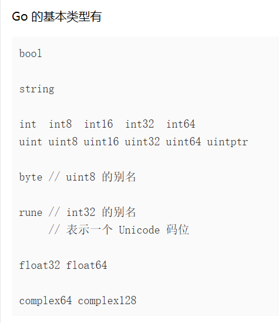

# Go 入门

## golang basic

* Go Proxy 已换源

## 1. 多文件

对于Go来说，如果一个名字是大写字母开头的，其就是已经导出的

```go
package main

import (
	"fmt"
	"math"
)

func main() {
	fmt.Println(math.Pi) // 正确运行
	fmt.Println(math.pi) // 报错
}

```

## 2. 函数

```go
func add(x int, y int) int {
	return x + y
}
```

类型放在变量名后面，返回类型放在函数名后面，支持多值返回

```go
func swap(x string, y string) (string, string){
	return y,x
}
x,y = swap(x,y)
```

## 3. 变量和变量声明

### 3.1 基础的变量

一般的变量声明和定义遵守着类型放后面的原则

```go
var i int = 2;
```

​​

**短赋值语句**

```go
i:=10
```

一般作为临时变量之类的使用，会自动推导类型

**零值**

对于那些没有初始化的声明变量，会根据类型赋值“零值”，例如0，false，“”

**类型转换**

Go对于类型变换的要求较为严格，在各种地方均要求显示的类型转换，甚至包括整形和浮点型的加减

```go
package main

import (
	"fmt"
)

func main() {
	var x int = 3
	var y float64 = 3.0
	fmt.Println(x+y) 报错
}

```

**常量和变量**

const表示常量，var表示变量

```go
const x int = 3
var y int = 3
```

‍

### 3.2 动态内存分配

在C/C++中，我们认为的动态内存分配均是在堆上，而像Java这样的GC语言为了确保安全，将大部分的变量都由确定到了JVM的堆上，而Go语言由编译器确定该变量是否应该分配在栈/堆上，因此无需我们关心

Go语言有两种创建变量的形式，make和new，new用来创建各种基础类型的指针

```go
	i := new(int)
	*i = 10

	s := new(student)
	*s = student{"h", 18}
```

使用make来创建变量，仅包括三种内置类型

* 切片
* 哈希表
* channel

## 4. 流程控制语句

### 4.1 循环语句

**for循环**

不需要加小括号，必须要大括号

```go
var sum int = 0
for i:=0; i<10; i++{
	sum += 1
}
```

对于Go语言不需要while，可以用for替代while

```go
for sum < 1000{
	sum += 1
}
```

无限循环

```go
for{
	sum+=1
}
```

### 4.2 分支语句

if-else基础语法和C相似，不需要在条件周围加上括号，但同时还有一些优化，例如我们可以在条件中做一些初始化工作，例如下面的这个v，可以在分支的各个模块内生效

```go
func pow(x, n, lim float64) float64 {
	if v := math.Pow(x, n); v < lim {
		return v
	}else{
		fmt.Printf("%f >= %f", v, lim)
	}
	return lim
}
```

Go中也有switch语句，效果和C类似，但是在各个语句块后面都有break

‍

### 4.3 defer

Go中有一个defer关键词，其后面对应的函数，会推迟到当前所在函数块结束返回前调用，但内部的参数计算会按照正常顺序完成

```go
func main() {
	defer fmt.Println("world")

	fmt.Println("hello")
}
```

## 5. 类型

### 5.1 指针

Go语言中是有指针的，但是我们不允许进行指针计算

```go
func main() {
	fmt.Println(Sqrt(2))
	var i int = 10
	var p *int = &i
	fmt.Println(*p)
}
```

### 5.2 结构体

```go
type Vertex struct {
	X int
	Y int
}
```

* 创建结构体 `var temp = Vertex{0, 0}`​
* 创建结构体指针 `var p = &Vertex{0, 0}`​
* 指针和字面值都可以通过 `.`​ 来访问内部变量

Go里面没有类似于C++的类，当我们要对结构体定义方法时，采用的是函数的语法糖

```go
func (v Vertex) Abs() float64{
	return math.Sqrt(v.X * v.X + v.Y * v.Y);
}

v.Abs()
```

但其实，当我们为结构体编写方法的时候，更常用的是对其指针类型编写方法，这样的方法可以实际修改类的内部成员，需要比较注意的一点在于，一个结构体对象调用该函数的时候，若其本身不为指针，也会自动取地址作为指针使用

```go
func (v *Vertex) Scale(f float64) {
	v.X = v.X * f
	v.Y = v.Y * f
}
```

当我们为一个结构体定制方法的时候，针对值和指针都应该编写相应的方法

### 5.3 数组

```go
var a[10] int;
primes := [6]int{2, 3, 5, 7, 11, 13};
```

数组和Python一样可以进行切片操作

```go
var a [10]int = [10]int{1, 2, 3, 4, 5, 6, 7, 8, 9, 10}
var temp = a[0:5]
fmt.Println(temp)
```

可以使用make创建动态数组

```go
b := make([]int, 0, 5) // len(b)=0, cap(b)=5

b = b[:cap(b)] // len(b)=5, cap(b)=5
b = b[1:]      // len(b)=4, cap(b)=4
```

可以使用range遍历数组

```go
var pow = []int{1, 2, 4, 8, 16, 32, 64, 128}

func main() {
	for i, v := range pow {
		fmt.Printf("2**%d = %d\n", i, v)
	}
}
```

### 5.4 map

```go
func main() {
	var m = make(map[string]Vertex)
	m["Bell Labs"] = Vertex{
		40.68433, -74.39967,
	}
	fmt.Println(m["Bell Labs"])
}
```

### 5.5 函数闭包

```go
func fibonacci() func() int {
	a, b := 0, 1
	return func() int {
		a, b = b, a+b
		return a
	}
}
func main() {
	f := fibonacci()
	for i := 0; i < 10; i++ {
		fmt.Println(f())
	}
}
```

### 5.6 接口

```go
type Abser interface {
	Abs() float64
}

func main() {
	var a Abser
	f := MyFloat(-math.Sqrt2)
	v := Vertex{3, 4}

	a = f  // a MyFloat 实现了 Abser
	a = &v // a *Vertex 实现了 Abser
}

func (v *Vertex) Abs() float64 {
	return math.Sqrt(v.X*v.X + v.Y*v.Y)
}
```

接口表示了一个类型需要实现的方法，要注意的是，该类型的指针实现了这个方法，那么接口也只能接受该类型的指针。

接口作为类型系统中的一种，也可以作为函数参数以及函数返回值，进行一系列操作。

即便赋值给接口的指针是空指针，只需要其对应的类型实现了相应的方法，依旧是可以传入的

总得来说，接口就是将具体的结构体化为能调用特定方法的抽象存在

**类型断言**

```go
// i是一个接口, T是一个类型
t := i.(T)
t, ok := i.(T)
```

我们可以从接口中提取特定的类型，这两个语句其实都在做相同的事，区别在于，第一个语句若提取失败会直接panic，而第二个语句会把提取是否成功的bool存储在ok中

由此扩展了类型选择的语法，使用type替代具体的类型

```go
func do(i interface{}) {
	switch v := i.(type) {
	case int:
		fmt.Printf("二倍的 %v 是 %v\n", v, v*2)
	case string:
		fmt.Printf("%q 长度为 %v 字节\n", v, len(v))
	default:
		fmt.Printf("我不知道类型 %T!\n", v)
	}
}
```

常见的接口比如fmt中的

```go
type Stringer interface {
    String() string
}
```

能被该接口接受的类型，都能够用string来描述自身

**错误接口**

```go
type ErrNegativeSqrt float64

func (e ErrNegativeSqrt) Error() string {
	return fmt.Sprintf("cannot Sqrt negative number: %v", float64(e))
}

func Sqrt(x float64) (float64, error) {
	if x < 0 {
		return 0, ErrNegativeSqrt(x)
	}
	z := 1.0
	for i := 0; i < 10; i++ {
		z -= (z*z - x) / (2 * z)
	}
	return z, nil
}

func main() {
	fmt.Println(Sqrt(2))
	fmt.Println(Sqrt(-2))
}
```

Go中的错误接口如下，当我们需要返回错误值的时候，需要定制一个错误类型，并且设定多返回值，当error的值为nil的时候，则说明未出错

```go
type error interface {
    Error() string
}
```

## 6. 并发

Go语言的协程是一大语言特色，启动一个协程的代码如下

```go
go f(x,y,z)
```

线程之间通信，可以通过chan类型实现，我们创建一个传递int变量的通道

```go
c := make(chan int)
```

在这一段代码中，我们实现了线程和主线程之间的通信，我们使用`<-`​这个标记来传递数据

```go
func sum(s []int, c chan int) {
	sum := 0
	for _, v := range s {
		sum += v
	}
	c <- sum // 发送 sum 到 c
}

func main() {
	s := []int{7, 2, 8, -9, 4, 0}

	c := make(chan int)
	go sum(s[:len(s)/2], c)
	go sum(s[len(s)/2:], c)
	x, y := <-c, <-c // 从 c 接收

	fmt.Println(x, y, x+y)
}
```

在默认的情况下，发送和接受端在另一端准备好之前，也就是运行到`<-`​的代码之前，就会阻塞，以此实现线程之间的同步

当我们创建信道的时候，还可以设定其缓冲区，当其缓冲区满之后就陷入阻塞，缓冲区就是指该信道可以传递的数据的个数，比如下面这个信道只能传递10个int，随后就会阻塞

```go
c := make(chan int, 10)
cap(c) // 10
```

**range 和 close**

我们可以用close手动关闭一个信道，同时在另一端可以通过range检测信道的关闭

```go
func fibo(n int, c chan int){
	x, y := 0,1
	for i:=0; i<n; i++{
		c <- x
		x,y = y,x+y
	}
	close(c)
}


func main() {
	c := make(chan int, 10)
	go fibo(cap(c), c)
	for i := range c{
		fmt.Println(i)
	}
}

```
