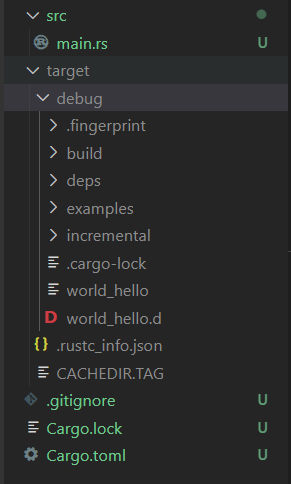
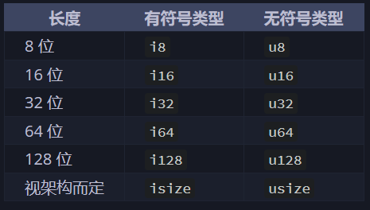

# Rust 入门

!!! note "rust"
    基础部分主要参照了Rust Course，写的已经比较详细了，因此我的笔记仅仅记录了一些重点。练习部分参照了Rust Course自带的一些练习以及CS110L的练习。把使用到的有用的链接放置于此 

    * [Rust Course](https://course.rs/about-book.html)
    * [CS 110L](https://reberhardt.com/cs110l/spring-2020/)
    * [rust-lang.org](https://doc.rust-lang.org/std/all.html) 官方文档


## 1. Cargo与文件结构

cargo 是rust的包管理工具，帮助我们构建rust项目和编译运行

* 新建一个rust项目`cargo new [name]`​
* 编译运行 `cargo run`​
* 编译`cargo build`​

生成的文件在`/target/debug`​中，如下图



如我们所见，默认的build和run结果是bebug结果，这与qt项目等类似，特点是编译快但运行慢，我们也可以通过`cargo build --release`​来构建release版本。

## 2. 变量

### 2.1 变量声明规范

Rust中的变量遵循常规编程语言中的一系列规矩，例如不可与关键词重复等等，命名也需要遵循一定的规范

* 可以手动设置变量的可变性，其默认是不可变

  * ​`let x = 5;`​ 不可变
  * ​`let mut x = 5;`​ 可变
  * ​`const x = 5;`​不可变

rust的编译器会给出warning当我们未使用一个变量的时候，此时我们如果确实需要这个变量，那么可以在其前面加一个下划线`let _x = 5;`​

**变量作用域**

Rust允许在同一代码块中使用两个相同名称的变量，但是后者的出现就会遮蔽前者

### 2.2 变量类型

Rust对于变量类型是严格的，不允许不同类型的相互赋值。Rust中的基础类型就像Java里的Integer一样绑定了基础的操作，并且Rust的对象支持运算符重载

可以通过`std::mem::size_of_val(&x)`​查看变量的内存大小

#### 整数类型

Rust中我们一般希望能够给出整数具体的位数，但是在运行效率和便利性上，我们首选 "i32"

​​

```rust
let mut x:i32 = 100_000; //对于数字字面量，可以加_来提高可读性
```

在debug模式下会检查整数溢出，而release下不会，但我们可以使用一些整数自带的方法来显式地检查溢出

#### 浮点数类型

浮点数类型比较简单，有两种 'f32' 和 'f64'。而浮点数的特殊性在于其不可以做精确比较（这个特性导致其不可做Map的key）

对于数学上的未定义行为，如负数做sqrt等，会返回Nan，我们可以通过`is_nan()`​方法来进行显示判断

#### 序列

Rust中的序列常用于循环体中，仅对于数字和字符

```rust
for i in 1..=5{
	println!("{}",i);
}
```

​`1..5`​和`1..=5`​的区别在于后者包括5，表现的行为类似Python中的range

#### 字符与字符串

Rust中单引号用于字符，双引号用于字符串，与C类似

当我们需要显式的类型转换的时候，需要使用到`as`​ 关键词

### 2.3 所有权与引用

所有权（Ownership）是Rust里面一个重要的概念，是一个agent拥有可以访问或者销毁一个资源的权限。所有权是唯一且独占的，一个变量仅有一个所有者。该所有者的作用领域消失时，该变量被丢弃。

```rust
fn main() {
    let temp = String::from("hello");
    let test = temp;
   // println!("{}",temp);
    println!("{}",test);
}
```

当test获取了该对象的所有权的时候，此时temp已经不再拥有所有权，此时如果取消注释，再次使用temp，就会报错；包括向函数里面传参的时候也一样

需要注意的是，在转移所有权的时候其实是可以改变变量的可变性的

#### 引用和借用

对于任何一个可变变量，Rust规定其在同一个作用域中，仅仅可以拥有一个可变引用或者多个不可变引用，下面一个例子我们分别构建了一个可变和不可变引用

> 由于其本身所有权就已经存在可变和不可变两种，可变引用只能针对可变的对象，但是我们可以把不可变对象的所有权交给可变对象

```rust
fn mut_test(temp:& mut String){
    (*temp) += "hello";
    println!("{}", *temp);
}
fn non_mut_test(temp:& String){
    println!("{}", *temp);
}
fn main() {
    let mut test1 = String::from("world");
    mut_test(&mut test1);
	mut_test(&mut test1);
    non_mut_test(&test1);
    println!("{}",test1)
}
```

上述程序是正确的，因为其所有的可变引用都自己这行函数调用中诞生销毁，因此**不存在共存的可变引用**。下面程序便是错误的

```rust
fn main() {
    let mut test1 = String::from("world");
    let mut t1 = &mut test1;
	let mut t2 = &mut test1;
	*t1 += "hello";
}
```

可变引用要**显式地说明**，如同cpp中的常量指针要显式说明一样，上述代码我们之所以可以创建多个可变引用，是因为这些可变引用都在各自函数的作用域中

#### 堆上元素和基本元素的区别

对于Rust而言，其和Java一样区分存储在堆上和栈上的变量的区别，对于简单的类型

```rust
let x = 1;
let y = x;
```

此时做的是**拷贝**，而前文中字符串类型的赋值，便是**移动**了，移动会导致原先元素中的变量失效。

```rust
fn main() {
    let temp = String::from("hello");
    let test = temp;
   // println!("{}",temp); 报错
    println!("{}",test);
}
```

在Rust中，任何想要对于复杂元素进行深拷贝的操作，都是**显式**的。

```rust
fn main() {
    let temp = String::from("hello");
    let test = temp.clone();
   // println!("{}",temp); 不报错
    println!("{}",test);
}
```

**关于函数与宏**

在这里其实有点问题，既然传入函数也是在对复杂元素做**移动**，那println咋办，其实在Rust中，我们常用的println!并非是一个函数，而是一个宏，因此其不影响所有权的问题

**Copy**

对于简单的类型，我们可以实现Copy方法，使其在赋值的时候自动调用拷贝语义而不是移动语义。

**函数返回的问题**

对于函数内部的临时对象，我们允许其把所有权转移出去，这样其生命周期随之延长；但是不允许将其引用返回出去。

```rust
fn get_string1() -> String{
  let temp = String::from("hello world");
  return temp;
}

fn get_string2() -> &str{
  let temp = String::from("hello world");
  return &temp;
}
```

#### RefCell 与 引用检查的局限性

Rust无法对于我们的引用做运行时检查，因此会有这样的代码

```rust
fn main() {
    let mut t = String::from("world");
    let mut tt = String::from("hello");
    let t1;
    let t2;
    if true {
        t1 = &mut t;
    }else{
        t1 = &mut tt;
    }
    if *t1 == "world"{
        t2 = &mut tt;
    }else{
        t2 = &mut t;
    }
    println!("{}", *t1);
    println!("{}", *t2);
}

```

让我们来解释一下上面这段代码，很显然，t1和t2绝对不可能是同一个变量的引用，但是由于编译器在做静态检查的时候无法分析分支结构的结果，其只能认为都是有可能发生的，因此会选择报错。

### 2.4 复合类型和模式匹配

模式匹配的目标是确定我们穷尽所有的可能性，尤其是Option中的None，模式匹配要求我们一定要对None做出处理。不仅仅是复合类型，rust甚至可以对`u8`​做模式匹配

```rust
let some_u8_value = 0u8;
match some_u8_value {
    1 => println!("one"),
    3 => println!("three"),
    5 => println!("five"),
    7 => println!("seven"),
    _ => (),
}
```

其中的`_`​是用来匹配其余所有的值，达到完全匹配的目标，`match`​构成的匹配，一定要覆盖所有的情况

模式匹配最常使用的方式就是针对Option，以确保将None的情况考虑进去

## 3. 语句与表达式

在之前的很多语言中我们并不区分这两种概念，但是在有函数式特性的语言中我们需要对他们做出更严格的定义

* statement 是一个完整的操作，不返回值，要加分号
* expression 返回值，不加分号

**语句**

```rust
let a = 8 ;
```

任何语句不能给其他东西赋值，语句不返回东西

**表达式**

函数，花括号，数学计算式，宏等等都是表达式，都会返回值，比如说

```rust
fn main() {
    let y = {
        let x = 3;
        x + 1
    };

    println!("The value of y is: {}", y);
}
```

## 4. 流程控制

if-else for while 等常规的流程控制语句在Rust中仍然有效。

但是Rust中经常涉及到在循环/分支中解构Option等对象，例如以下代码

```rust
impl<T:PartialEq> PartialEq for LinkedList<T> {
    fn eq(&self, other: &Self) -> bool {
        if self.size != other.size{
            false
        }else{
            let mut current1: &Option<Box<Node<T>>> = &self.head;
            let mut current2: &Option<Box<Node<T>>> = &other.head;
            while let (Some(node1), Some(node2)) = (current1, current2){
                if node1.value != node2.value {
                    return false;
                }
                current1 = &node1.next;
                current2 = &node2.next;
            }
            return true;
        }
    }
}
```

在上述代码中，只要current1和current2中有一个None，就会导致模式匹配失败，从而导致循环退出

## 5. 函数式编程

```rust
use std::thread;
use std::time::Duration;

fn workout(intensity: u32, random_number: u32) {
    let action = || {
        println!("muuuu.....");
        thread::sleep(Duration::from_secs(2));
        intensity
    };

    if intensity < 25 {
        println!(
            "今天活力满满，先做 {} 个俯卧撑!",
            action()
        );
        println!(
            "旁边有妹子在看，俯卧撑太low，再来 {} 组卧推!",
            action()
        );
    } else if random_number == 3 {
        println!("昨天练过度了，今天还是休息下吧！");
    } else {
        println!(
            "昨天练过度了，今天干干有氧，跑步 {} 分钟!",
            action()
        );
    }
}

```

函数闭包，可以有效捕获外界的变量，当一个函数在多个地方调用的时候，为了避免多次修改参数，应当使用函数闭包

对于一个简单的闭包

```rust
let equal_to_x = |z| z == x;
```

其实际的类型为`Fn(usize) -> bool`​，包括这种特征在内，一共有三种不同闭包捕获特征

* Fn 获取捕获变量的不可变引用
* FnMut 获取捕获变量的可变引用
* FnOnce 获取捕获变量的所有权

## 6. 多线程

* todo

## 7. 生命周期

### 7.1 函数中的生命周期

我们来看一段代码

```rust
fn longest(x:&str, y:&str) -> &str{
  if x.len() > y.len() {
    return x;
  }else{
    return y;
  }
}
```

这段代码会报错给我们，缺少生命周期标记，原因在于我们并不清楚返回的是x还是y，编译器在编译期会无法进行生命周期的检查，因此需要我们手动进行标注

能够通过编译的代码如下

```rust
fn longest<'a>(x:&'a str, y:&'a str) -> &'a str{
  if x.len() > y.len() {
    return x;
  }else{
    return y;
  }
}
fn main() {
  let s1 = String::from("hello");
  let s2 = String::from("world!");
  let s = longest(&s1, &s2);
  println!("longest is {}", s);
}
```

实际上`‘a`​的标记，表示该变量的生命周期应该大于等于`’a`​，就是表示返回值的生命周期，与两个变量生命周期的最小值相同

这样的做法依旧是粗暴的，因为处于编译期的我们还是无法使得生命周期绑定在那个真的要返回的值上面，只能比较直接地绑定在其中的较小值，这样会导致本身没有问题的代码也会出现问题，比如下面这一行

```rust
fn main() {
    let string1 = String::from("long string is long");
    let result;
    {
        let string2 = String::from("xyz");
        result = longest(string1.as_str(), string2.as_str());
    }
    println!("The longest string is {}", result); //报错
}
```

‍

### 7.2 结构体的生命周期

之前我们的结构体中都是实际的成员类型，拥有这所有权，通过添加生命周期标记，我们可以将引用作为结构体的成员

```rust
struct sentence<'a>{
  part: &'a str
}

  let novel = String::from("hello. this is a world");
  let first_sentence = novel.split('.').next().expect("there is no .");
  let i = sentence{
    part: first_sentence
  };
```

该标注表示，这个引用的生命周期应该比这个结构体要长，事实也确实如此，这个引用定义在结构体初始化之前，如果我们整点花活

```rust
#[derive(Debug)]
struct sentence<'a> {
    part: &'a str,
}

fn main() {
    let i;
    {
        let novel = String::from("Call me Ishmael. Some years ago...");
        let first_sentence = novel.split('.').next().expect("Could not find a '.'");
        i = sentence {
            part: first_sentence,
        };
    }
    println!("{:?}",i);
}
```

**结构体实现的生命周期**

```rust
impl<'a> sentencet<'a> {
    fn announce_and_return_part(&self, announcement: &str) -> &str {
        println!("Attention please: {}", announcement);
        self.part
    }
}
```

这里的生命周期自动以self为准，返回的也恰好是self的成员变量，没有什么问题

如果我们这里返回announcement就会报错，会显示生命周期不够长，如果我们非要这么做的话，可以这么搞一下，这里的`'a : 'b`​，是我们手动标记`'a`​的生命周期要长于`'b`​

```rust
impl <'a:'b , 'b> sentence<'a> {
  fn announce_and_return_part(&'a self, announcement: &'b str) -> &'b str {
      println!("Attention please: {}", announcement);
      //self.part
      announcement
  }
}
```

### 7.3 生命周期消除

一般来说，只要返回值里面有引用，我们就需要使用生命周期标注，但是Rust编译器做了一些优化，引入了三条消除规则

* 每个引用参数都有独立的生命周期
* 若只有一个引用参数，其生命周期会赋值给所有的输出的引用
* 若有多个引用参数，且其中一个是&self或者& mut self，以这两种生命周期为准，赋值给所有输出的引用

### 7.4 静态生命周期标注

```rust
let s : &'static str = "hello world"; 
```

静态的生命周期标注，说明该变量的生命周期和整个程序一样长，基本上直接消除了编译器的生命周期检查，是一个比较强大又危险的标注

但是即便如此，也没法返回临时变量，但是如果滥用，在一些复杂情形下可能还是会产生悬垂指针

```rust
fn get_string2() -> &'static str{
  let temp = String::from("hello world");
  return &temp; //报错
}
```

## 8. 测试

如下是一个Rust里的简单的测试模块

```rust
#[cfg(test)]
mod tests {
    use super::*; // 获取父模块中的内容
    #[test]
    fn test_eq() {
        let mut list1: LinkedList<u32> = LinkedList::new();
        let mut list2: LinkedList<u32> = LinkedList::new();
        assert_eq!(list1==list2, true);
        for i in 1..12{
            list1.push_front(i);
            list2.push_front(i);
        }
        assert_eq!(list1==list2, true);
        list1.pop_front();
        assert_eq!(list1==list2, false);
    }
}
```

我们可以通过`cargo test`​执行当前项目的所有测试，更多的情况下我们会使用`cargo test test_eq`​ 来执行特定的测试

## 9. 宏

宏的存在可以帮助我们实现两种主要目标

* 元编程，本质上是自动生成一些代码，例如`#[derive(Debug)]`​的过程中，会自动帮我们生成相应的特征代码
* 可变参数，Rust的函数本身不支持可变参数，但是宏可以实现这一点

### 9.1 macro_rules!

这种宏一般被称为声明式宏，也是最为常见的宏，其本身和`match`​表达式较为接近

## 10. 错误处理

### 10.1 Result

所有的可恢复错误本质上是需要多一条分支来处理这个问题，对于Rust的Result类型，我们往往需要采取一些手段去处理

* ​`match`​匹配Result
* ​`unwrap`​ 出问题就直接 `panic!`​
* ​`expect(理由)`​ 出问题就`panic!`​ 并且给出相应信息

但在编程中，最多的情况是我们在一个函数中遇到问题，我们需要把这个问题抛给上层函数去解决，但是如果每次都用match去匹配然后返回的话代码会比较冗长，因此就产生了一个宏  `？`​

这个宏展开之后的结果就是和match返回效果是一致的

```rust
fn read_username_from_file() -> Result<String, io::Error> {
    let mut f = File::open("hello.txt")?;
    let mut s = String::new();
    f.read_to_string(&mut s)?;
    Ok(s)
}
fn read_username_from_file() -> Result<String, io::Error> {
    // 打开文件，f是`Result<文件句柄,io::Error>`
    let f = File::open("hello.txt");

    let mut f = match f {
        // 打开文件成功，将file句柄赋值给f
        Ok(file) => file,
        // 打开文件失败，将错误返回(向上传播)
        Err(e) => return Err(e),
    };
    // 创建动态字符串s
    let mut s = String::new();
    // 从f文件句柄读取数据并写入s中
    match f.read_to_string(&mut s) {
        // 读取成功，返回Ok封装的字符串
        Ok(_) => Ok(s),
        // 将错误向上传播
        Err(e) => Err(e),
    }
}
```

类似的`？`​宏也可以做Option的传播

## 11. 包和模块

* todo

## 12. 智能指针

### 12.1 Rc and Arc

当我们有时不得不违反Rust的规则，使得一个值有多个所有者的情况，就需要用到智能指针来解决这个问题，例如`Rc`​就是一个处理该问题的常用做法

```rust
use std::rc::Rc;
fn main() {
    let a = Rc::new(String::from("hello, world"));
    let b = Rc::clone(&a);

    assert_eq!(2, Rc::strong_count(&a));
    assert_eq!(Rc::strong_count(&a), Rc::strong_count(&b))
}
```

所谓`Rc::clone`​仅仅拷贝了智能指针本身，并未对底层的`String`​做出拷贝，并且会使得计数器加一，但是缺陷在于`Rc`​仅能处理多个不可变引用的情形

```rust
use std::rc::Rc;
use std::thread;

fn main() {
    let s = Rc::new(String::from("多线程漫游者"));
    for _ in 0..10 {
        let s = Rc::clone(&s);
        let handle = thread::spawn(move || {
           println!("{}", s)   //error[E0277]: `Rc<String>` cannot be sent between threads safely
        });
    }
}
```

并且还有一个问题，`Rc`​底层的计数器是没有线程安全保护的，如上图的s不能被传入多线程代码中，因此相对的标准库里还有`Arc`​，表示atomic rc存在，可以在多线程代码中使用，之所以需要区分是因为线程安全的保护是有开销的

### 12.2 Cell and RefCell

```rust
fn main() {
    let mut x = String::from("hello");
    let one = &x;
    x.push_str("word");
    let two = &x;
    println!("{}, {}", one, two);
}
```

有时我们会想写这样的代码，上述代码看着没问题，但是要注意的事，我们在`push_str`​处对x进行了可变引用，之后就不能对其做任何其他引用了，因此这段代码会报错

```rust
use std::cell::Cell;
fn main() {
  let c = Cell::new("asdf");
  let one = c.get();
  c.set("qwer");
  let two = c.get();
  println!("{},{}", one, two);
}
```

我们可以使用Cell来实现这个功能，Cell会在get赋值之后自动做拷贝工作，也可以用set来修改这个值，但是Cell只适用于实现了Copy功能的类型，如果该类型未曾实现Copy功能，则需要使用RefCell，RefCell的功能在于把检查从编译时推迟到运行时

一个常用的做法就是把Rc和RefCell合并起来使用，可以使得变量的使用更加灵活

```rust
use std::cell::RefCell;
use std::rc::Rc;
fn main() {
    let s = Rc::new(RefCell::new("我很善变，还拥有多个主人".to_string()));

    let s1 = s.clone();
    let s2 = s.clone();
    // let mut s2 = s.borrow_mut();
    s2.borrow_mut().push_str(", oh yeah!");

    println!("{:?}\n{:?}\n{:?}", s, s1, s2);
}
```

> 由于 `Rust`​ 的 `mutable`​ 特性，一个结构体中的字段，要么全都是 `immutable`​，要么全部是 `mutable`​，**不支持针对部分字段进行设置**。比如，在一个 `struct`​ 中，**可能只有个别的字段需要修改，而其他字段并不需要修改**，为了一个字段而将整个 `struct`​ 变为 `&mut`​ 也是不合理的。
>
> 所以，实现 **内部可变性** 的 `Cell`​ 和 `RefCell`​ 正是为了解决诸如这类问题存在的，通过它们可以实现 `struct`​ 部分字段可变，而不用将整个 `struct`​ 设置为 `mutable`​。

如果需要保证的线程安全的`RefCell`​可以考虑`UPSafeCell`​

## Rust实例

### iteration invalidation

```rust
fn main(){
	let v = vec![1,2,3];
	let p = &v[1];
	v.push(4);
	println!("v[1]:{}", *p);
}
```

让我们考虑C++的情形，上述代码其实非常的不安全，因为vector类型是存在扩容重整的，如果我们忘记使用迭代器而只是采用普通指针去访问，在扩容重整之后就会留给我们一个野指针

而在Rust编译器中，直接不允许执行上述代码，原因在于p作为一个指针，不可变地借用了v中的一个元素，而v需要push的时候，需要可变地借用v中所有元素，此时两个操作发生冲突

但是不可否认的是，虽然Rust编译器可以做很强大的检查，但是其不可避免地会错判一些本身是安全的多借用情形。对于此种问题我们往往通过稍微调整代码就可以解决
