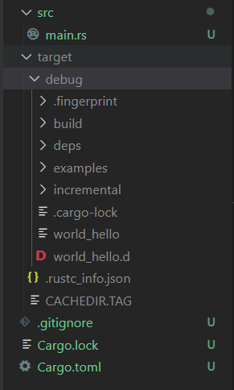
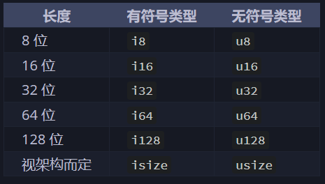

# Rust 入门

## Cargo与文件结构

cargo 是rust的包管理工具，帮助我们构建rust项目和编译运行

* 新建一个rust项目`cargo new [name]`​
* 编译运行 `cargo run`​
* 编译`cargo build`​

生成的文件在`/target/debug`​中，如下图



如我们所见，默认的build和run结果是bebug结果，这与qt项目等类似，特点是编译快但运行慢，我们也可以通过`cargo build --release`​来构建release版本。

## 变量

### 变量声明规范

Rust中的变量遵循常规编程语言中的一系列规矩，例如不可与关键词重复等等，命名也需要遵循一定的规范

* 可以手动设置变量的可变性，其默认是不可变

  * ​`let x = 5;`​ 不可变
  * ​`let mut x = 5;`​ 可变
  * ​`const x = 5;`​不可变

rust的编译器会给出warning当我们未使用一个变量的时候，此时我们如果确实需要这个变量，那么可以在其前面加一个下划线`let _x = 5;`​

**变量作用域**

Rust允许在同一代码块中使用两个相同名称的变量，但是后者的出现就会遮蔽前者

### 变量类型

Rust对于变量类型是严格的，不允许不同类型的相互赋值。Rust中的基础类型就像Java里的Integer一样绑定了基础的操作，并且Rust的对象支持运算符重载

可以通过`std::mem::size_of_val(&x)`​查看变量的内存大小

#### 整数类型

Rust中我们一般希望能够给出整数具体的位数，但是在运行效率和便利性上，我们首选 "i32"

​​

```rust
let mut x:i32 = 100_000; //对于数字字面量，可以加_来提高可读性
```

在debug模式下会检查整数溢出，而release下不会，但我们可以使用一些整数自带的方法来显式地检查溢出

#### 浮点数类型

浮点数类型比较简单，有两种 'f32' 和 'f64'。而浮点数的特殊性在于其不可以做精确比较（这个特性导致其不可做Map的key）

对于数学上的未定义行为，如负数做sqrt等，会返回Nan，我们可以通过`is_nan()`​方法来进行显示判断

#### 序列

Rust中的序列常用于循环体中，仅对于数字和字符

```rust
for i in 1..=5{
	println!("{}",i);
}
```

​`1..5`​和`1..=5`​的区别在于后者包括5

#### 字符与字符串

Rust中单引号用于字符，双引号用于字符串，与C类似

### 所有权与引用

所有权（Ownership）是Rust里面一个重要的概念，是一个agent拥有可以访问或者销毁一个资源的权限。所有权是唯一且独占的。

```rust
fn main() {
    let temp = String::from("hello");
    let test = temp;
   // println!("{}",temp);
    println!("{}",test);
}
```

当test获取了该对象的所有权的时候，此时temp已经不再拥有所有权，此时如果取消注释，再次使用temp，就会报错；包括向函数里面传参的时候也一样

对于任何一个变量，Rust规定其在作用域中，仅仅可以拥有一个可变引用或者多个不可变引用，下面一个例子我们分别构建了一个可变和不可变引用

> 由于其本身所有权就已经存在可变和不可变两种，可变引用只能针对可变的对象，但是我们可以把不可变对象的所有权交给可变对象

```rust
fn mut_test(temp:& mut String){
    (*temp) += "hello";
    println!("{}", *temp);
}
fn non_mut_test(temp:& String){
    println!("{}", *temp);
}
fn main() {
    let mut test1 = String::from("world");
    mut_test(&mut test1);
	mut_test(&mut test1);
    non_mut_test(&test1);
    println!("{}",test1)
}
```

可变引用要显式地说明，如同cpp中的常量指针要显式说明一样，上述代码我们之所以可以创建多个可变引用，是因为这些可变引用都在各自函数的作用域中

#### RefCell 与 引用检查的局限性

Rust无法对于我们的引用做运行时检查，因此会有这样的代码

```rust
fn main() {
    let mut t = String::from("world");
    let mut tt = String::from("hello");
    let t1;
    let t2;
    if true {
        t1 = &mut t;
    }else{
        t1 = &mut tt;
    }
    if *t1 == "world"{
        t2 = &mut tt;
    }else{
        t2 = &mut t;
    }
    println!("{}", *t1);
    println!("{}", *t2);
}

```

让我们来解释一下上面这段代码，很显然，t1和t2绝对不可能是同一个变量的引用，但是由于编译器在做静态检查的时候无法分析分支结构的结果，其只能认为都是有可能发生的，因此会选择报错。

## 语句与表达式

在之前的很多语言中我们并不区分这两种概念，但是在有函数式特性的语言中我们需要对他们做出更严格的定义

* statement 是一个完整的操作，不返回值，要加分号
* expression 返回值，加分号

## Rust实例

### iteration invalidation

```rust
fn main(){
	let v = vec![1,2,3];
	let p = &v[1];
	v.push(4);
	println!("v[1]:{}", *p);
}
```

让我们考虑C++的情形，上述代码其实非常的不安全，因为vector类型是存在扩容重整的，如果我们忘记使用迭代器而只是采用普通指针去访问，在扩容重整之后就会留给我们一个野指针

而在Rust编译器中，直接不允许执行上述代码，原因在于p作为一个指针，不可变地借用了v中的一个元素，而v需要push的时候，需要可变地借用v中所有元素，此时两个操作发生冲突

但是不可否认的是，虽然Rust编译器可以做很强大的检查，但是其不可避免地会错判一些本身是安全的多借用情形。对于此种问题我们往往通过稍微调整代码就可以解决
