# python 入门

!!! note "python"
	主要是应付期末考试写的笔记，里头包含了不少莫名奇妙的细节doge

## Part1 IO

```python
m = int(input("m = "))
print(m)
```

input 内部的字符串作为输入提示词，int将输入的东西转化特定的类型

默认的输出可以有多个，用‘，’隔开，输出的时候用空格隔开

```python
a,b,c=[1,2,3];
print(a,b,c)
print(a,end='')  最后不换行
print(a,b,sep='')  原本用空格隔开的数据取消空格  
```

输出两个字符串如果是单纯的空格隔开，结果中就不加空格

```python
print("aaa"    "bbb")  aaabbb
```

**格式化输入输出**

输入

一行中输入多个整数 并且用逗号隔开，input的默认结果都是字符串，split内部不加自动是按照空格分割

```python
a, b, c = map(int,input().split(','))
```

上述输入只针对int数据，如果有一个数据是5.0，就会有问题，如果要cover所有有关数据的表达式，可以用eval

```python
a,b,c=map(eval, input().split())
```

输出

```python
a, b = 5, 10
print('%d * %d = %d' % (a, b, a * b))
print(f'{a} * {b} = {a * b}') 需要在其前面加入f
print("{}{:>14.1f}".format(a,b)
'{:10.2f}' 占10个，同时保留两位小数，但是如果本身数字就比10位多，那么还是会超出十位2
```

保留小数并且右对齐

```python
fahr = i * 1.8 + 32
stfahr = "{}".format(fahr,'.2f')
print("{}{:>14}".format(i,stfahr))
```

​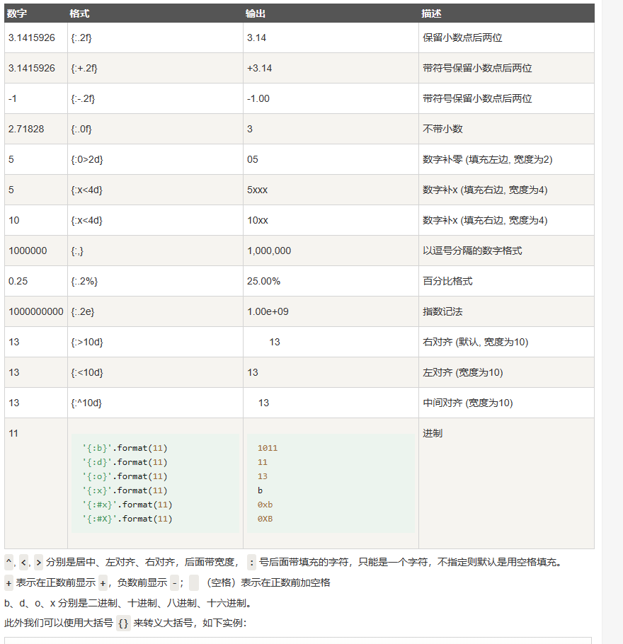​

​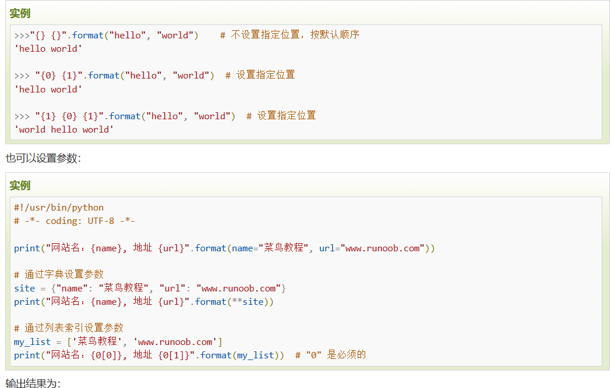​

如果不加< > 对于整数默认是>,也就是向前补空格；对于字符串默认是<，也就是向后补空格，“：”前面的数字是用来判定是format里的参数的第几个

```python
a = 100
print("{:8}".format(a))
print("{:>8}".format(a))
print("{:<8}".format(a))
print("{:08}".format(a))
print("{:0<8}".format(a))
print("{:.2f}".format(a))
print("{:0<8.2f}".format(10))
print("{:0>8.2f}".format(10))
```

结果为

​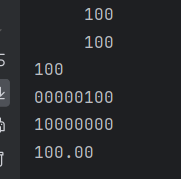​

* **print(&quot;{:0^8}&quot;.format(a)) 居中对齐**
* print("{:,}".format(a)) 千分位

冒号后面的东西表示格式，冒号前面的东西表示是format中的第几个参数

b d x o 前面加上# 可以显示 0x 0o等

{}内部只能放字面量，无法识别变量

## Part2 type

* ​`int()`​：将一个数值或字符串转换成整数，可以指定进制(只针对字符串，该指定进制的含义是指把该字符串当xx进制来看)。

  * 被转换的字符串左右可以有空格，有效字符内部不能有空格
  * 对于bool类型，int(True) 是 1，int(False) 是 0
  * int可以转换数字10.0但是无法转换"10.0"，对于数字的转换是向下取整
* ​`float()`​：将一个字符串或整数转换成浮点数。
* ​`str()`​​​​​：将指定的对象转换成字符串形式，可以指定编码。
* ​`chr()`​​​​​：将整数转换成该编码对应的字符串（一个字符）。

  * ​`chr(97) == 'a'`​
* ​`ord()`​​​​​：将字符串（一个字符）转换成对应的编码（整数）。

  * 如果是单个字符，转换成ASCII；如果是中文，转换成Unicode
* ​`list()`​: 将一个字符串转换成单个字符的列表
* ​`bool()`​: 只有0，空字符串空列表，None转换过来时False，其他转换过来的都是True
* ​`set()`​: 将字符串转换成set的时候，每个char
* ​`list()`​ 将字符串转成list的时候，每个char

对于Python中的类型，我们可以使用dir，查询其所有的方法

```python
dir(tuple)
```

Python中没有单个字符，都是字符串

浮点数在判断大小的时候要注意可能存在一定的差

### **int**

```python
a = int("123a",16)
a = int(126.5588)
```

第二个参数可以制定字符串的进制，如果不加16，前面这个字符串会被默认为十进制，会发生错误

bin(12.5) 是错误的 bin只能针对int

四舍六入五平分

int的进制可以互相转换，如上述代码所示，但是只能从string转为int，如果出现

```python
int("92",8)
```

这种情形，会报错，因为92并不是一个合法的8进制数

* 16进制 hex(16)  = 0x10
* 2进制 bin(10) = 0b1010

上述这些hex，bin，oct生成的类型都是str，并且0x和0b是字符串的一部分，如果要只截取01的部分的话，需要使用切片[2:]

### **list**

列表并非数组，数组有单独的对象

```python
peopleName = ["a","b","c"]
len(peopleName)
newlist = peopleName [1:2] 截取peopleName[1]
```

列表的索引

```python
[...]
0 1 2 3 ... 
... -3 -2 -1
```

用sorted去处理列表，原列表不变，返回排序好的；用sort是直接在原列表上进行排序

列表的切片是左闭右开的

列表构造器

```python
L1 = [c for c in range(101)]
```

其基本形式为

```python
L1 = [与c有关的表达式 for c in list if 筛选式]
```

切片的形式，begin和end都可以超过，会自动补到起始和最后

```python
l [begin:end:顺序和间隔]
```

**常用的方法**

* append 把元素加到列表末尾
* remove 删除第一个和这个元素相同的元素  返回值为None
* max(list) min(list) 找到最大最小 但是内部元素都可比
* len(list)
* ​`a in list`​ `a not in list`​ 返回bool
* index(element) 找到该element的下标，如果未找到直接报错
* clear() 清空
* count
* copy
* extend 同+=
* insert(index, x) 在指定下标中插入单个元素，插入列表会变成二级的
* pop(index) 返回并删除指定元素，默认为-1
* reverse() 翻转自己，无返回值
* sort()
* ```python
  l = [1] * 3 
  [1,1,1] 这算是拷贝
  ```

**复制和拷贝**

如果只是单纯的赋值，则两个变量指向同一个list

如果要做拷贝，那么需要使用切片`list2 = list1[:]`​，但是切片的拷贝仅对一层，内部还是引用

​`list.copy()`​也是一层拷贝

### set

和字典一样都用{}，如果要创建一个空set，set的元素和字典的键一样，必须是不可变对象

```python
a = {} 空字典
a = set() 空set
```

set()可以将列表和元组转换过来，集合最重要的属性是没有重复元素，如果创建的时候写了重复元素，但是创建完成的时候会被消除重复值

```python
set("123") = {"1","2","3"}
```

* add() remove() 增删元素
* min() max() len() sum()
* 内部元素无序，不能下标访问
* 循环遍历的结果是确定的？
* issubset(s2) issuperset(s1) == !=判断集合关系
* 也可以用 < <= > >= 来判断集合关系，真子集，子集，真超集，超集
* ​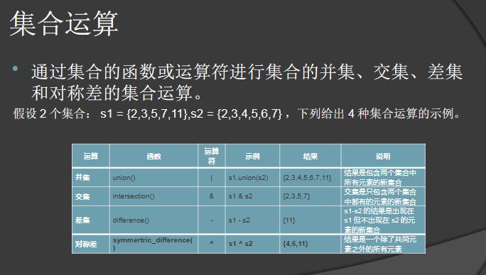​

把列表转换成set再转换成列表，确实可以做到去重，但是顺序不能保证，但是可以最后再加一个排序，key = 原列表.index

### **字典**

```python
scores = {'AAA':88,'BBB':99,'CCC':100}
Ascore = scores['AAA']
scores.update('DDD'=77,'EEE'=66)
scores.pop('AAA')
```

创建字典有很多方法

* d = {1:"hello"}
* d = dict([(1:"hello"),(2:"world")])
* d = dict(1="hello", 2="world")

可变对象不可作为字典的键，比如列表和字典

数字，字符串和元组都可以

* del d['张三'] 删除条目，找不到抛出异常
* d['李四'] = 1 增加条目，不能不加等号，会变成访问，访问失败就变成异常
* 循环循环的是键，in not in 也判断的是键
* 字典合并 d3 = {**d1, **d2}
* keys() 获取键列表 values() 获取值列表 items 返回元组列表
* clear()
* get(key, value) key能找到返回这个key的value，找不到返回形参的value，默认值为None

### **str**

```python
"\m"
输出 \m
实际上这是有语法问题的，因为\是转义的标志，如果后面字符是不能转义的会报错，但是python会将其转换成
"\\m"
str(100) 就是 "100"
int("100") 就是 100
```

python中的字符串支持[]访问，同时支持左闭右开的切片，但其本质上属于不可修改的数据类型，不能通过[]和切片去更新其内部的值

但是其允许字符串的拼接，也可以通过replace方法更新其内部的值

字符串类型不能直接与其他类型相加

```python
ch = "cc" + 123 #error
```

**一些关键的方法**

* format 见格式化输入输出
* strip() 去除左右空格 还有lstrip()和rstrip()
* split() 按照某个元素分割，默认为空格，如果有连续的两个分割元素，会生成一个空字符串
* find() 按照某个str去找，如果有，返回第一个index，如果没有，返回-1，可以有第二第三个参数，其实就是对字符串做切片
* join()  `str1.join(str或者列表)`​  如果join参数是str，则会把str按字符分割，每个分割里放一个str1；放列表之类的也是一样的，不过是按照列表分割
*  

  * index() 通用的序列子列查找，没找到返回ValueError，需要使用异常捕获
  * find() 只对于字符串，没找到返回 -1
* lower() upper() 转换大小写
* replace("old sub str","new sub str") 不是直接在str上修改，是返回修改完的str，如果未找到老的字符串，则不做修改，返回原字符串，也不会报错
* count("sub str") 查找子串出现次数
* title() 返回新的字符串，里面所有单词的开头字母大写
* isdigit() 不支持 + - 只有连续纯数字才行
* isalpha() 只支持连续纯字母

**chr**

char类型和数字之间的转换

* ord('0') 是 48 是ascii
* chr(48) 是 '0'

转义字符

* ​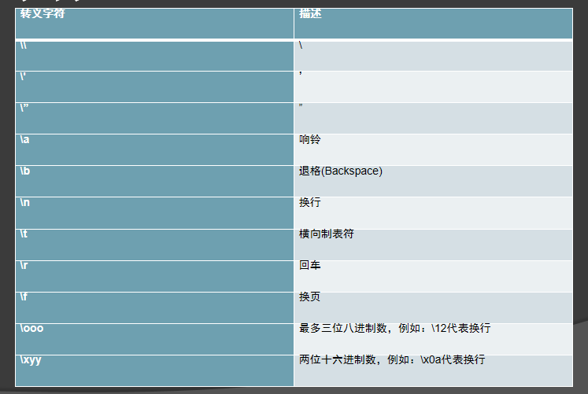​

### **complex**

输出的时候加()

```python
>>>complex(1, 2)
(1 + 2j)
 
>>> complex(1)    # 数字
(1 + 0j)
 
>>> complex("1")  # 当做字符串处理
(1 + 0j)
 
# 注意：这个地方在"+"号两边不能有空格，也就是不能写成"1 + 2j"，应该是"1+2j"，否则会报错
>>> complex("1+2j")
(1 + 2j)
```

### **bool**

Python中的bool类型是True和False

### 字符串

对于教材中提到的常用函数需要做一个了解

* 使用原始字符串 `s = r'hello'`​也即不使用转义字符，就原样输出，尤其是我们需要输出反斜杠的时候
* 删除前后空格 `'  hello '.strip()`​
* 查找子串，找到返回第一个子串的位置

  * index() 通用的序列子列查找，没找到返回ValueError，需要使用异常捕获
  * find() 只对于字符串，没找到返回 -1
* 是否为英文字母
* 是否为数字字符

字符串内容的修改只能通过形成新的字符串，其内部的title，replace等函数也都是形成新的字符串

* str的格式转换函数 d 0o b x X f e s  格式字符与引用数据类型要一致，整数可以指定不同进制
* format 千分位

### 列表和元组

列表可变元组不可变

**列表**

二维列表的每个元素长度没有限制，因为其内部的元素类型是没有限制的

## Part3 分支与循环

**分支结构**

```python
x = float(input('x = '))
if x > 1:
    y = 3 * x - 5
elif x >= -1:
    y = x + 2
else:
    y = 5 * x + 3
```

python可以直接用 'and' 代替 &&

**循环结构**

for 循环中常使用到一个叫range的功能

* ​`range(101)`​：可以用来产生0到100范围的整数，需要注意的是取不到101。
* ​`range(1, 101)`​：可以用来产生1到100范围的整数，相当于前面是闭区间后面是开区间。
* ​`range(1, 101, 2)`​：可以用来产生1到100的奇数，其中2是步长，即每次数值递增的值。
* ​`range(100, 0, -2)`​：可以用来产生100到1的偶数，其中-2是步长，即每次数字递减的值。

```python
sum = 0
for x in range(101):
    sum += x
print(sum)
```

while 循环与c类似，同样可以使用break跳出

里面有for和while循环还可以加else语句，只要不break就会执行else

## Part4 function

```python
def sayHello():
	print("hello world")
```

由于python对于类型检查较为自由，因此python不需要函数重载，但是python支持默认参数

```python
def roll_dice(n=2):
    """摇色子"""
    total = 0
    for _ in range(n):
        total += randint(1, 6)
    return total
```

特殊的函数 lambda 表达式

```python
func = lambda x,y,z: x+y+z
print(func(1,2,3))
```

函数也是对象，有id, type 和 value

​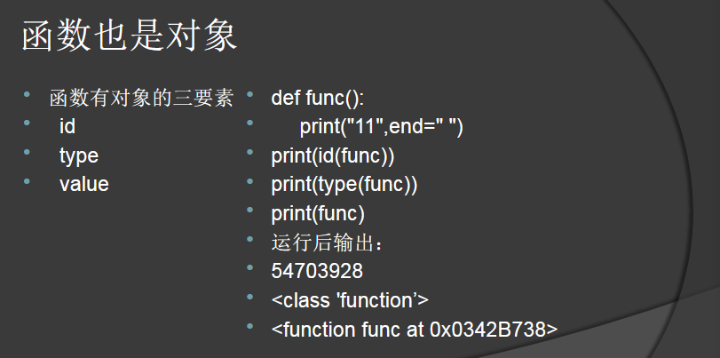​

Python处理函数参数有一些更灵活的方法

* 位置参数，按照正常函数的意思，顺序写过去 `func(1,2,3)`​
* 关键词参数，对照形参写，`func(x=1,y=2,z=3)`​
* 位置参数+关键词参数混用，必须先写位置参数，再写关键词参数，位置参数先占用

  * ​`func(1,z=2,y=3)`​
* 默认参数，参照cpp，有默认参数后，后面的参数也必须有默认参数
* 不定长参数，会将这些参数化为一元元组

  * ```python
    def cun(a, *b):
    	print(b)
    cun(1,2,3,4) 输出(2,3,4)
    cun(1) 输出()
    ```

* 字典参数
* ```python
  def func(**a):
  	print(a)
  func(x1 = 1) 输出{"x1": 1}
  ```

​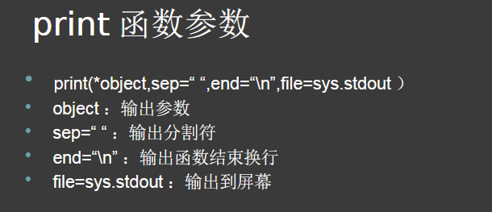​

​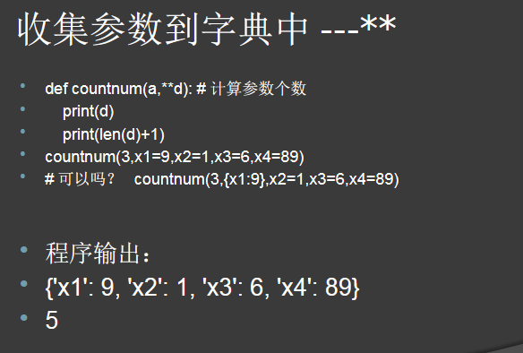​

实参可变，形参可以影响实参；反之不能影响

不return，或者return后面不加表达式，都返回None

## Part5 module

python的文件支持模块化处理，例如我们在多个文件里都定义了同名函数foo

```python
from module1 import foo 
```

用上述做法来获取特定的foo，或者

```python
import module1 as m1
import module2 as m2

m1.foo()
m2.foo()
```

用上述方法来区分

## Part6 运算符号

* 算术运算符
* 关系运算符
* 逻辑运算符

python支持很多种不同的运算符号，例如 //= 和 /=

/ 一定会产生浮点数，输出最少保留一位小数

Python的整除是//而不是/

浮点数也可以做整除和取余，整除的结果是整数，但是类型是浮点数，比如5.0

Python

```python
5.0 == 5 是 True
其余的类型不能做转换
```

字符串类型不能和整数做加法

**整除是向下取整 -9 // 2 是 -5**

3 ** 2 ** 3 是倒着计算的 先计算后面的 2 ** 3

只有幂运算 ** 是右结合的，其余均是左结合的

python的关系运算符会连续书写，中间以and分割

```python
 x>0 == 1
就是 x>0 and 0==1
```

* round有什么用
* 1J 这类数是什么意思

Python不支持等号的传递，只支持最基础的多变量赋值

```python
x=(y=(z+1))   是错误的
a = b = c = 1 是正确的
```

Python之中同样存在，只要or前面是True，就不做后面的任何计算

**优先级最低的是或 or，然后是与 and, 优先级最高的是非 not**

and ：a and b，如果 a 为 False，a and b 返回 a 的值，否则返回 b 的计算值。  
or：a or b，如果 a 是 True，a or b 返回 a 的值，否则它返回 b 的计算值。

0在判断的时候视作False，但是还是输出0

同时切记得短路逻辑

Python中没有 "--x" 这种自减含义，在Python中这视为两个被抵消的减号

x=y=0 -> x=0; y=0

x *  *=y+12 -&gt; x=x **  (y+12)

**round**

是Python中的四舍五入运算符

```python
round(5.5) 6
round(5.49999999999) 5
```

后面还可以跟上一个值，来确定最后要保留的到哪一位

```python
round(15.22292,3) 15.223
round(15.22222,3) 15.222
round(15.00092,3) 15.001
round(15.00010,3) 15.0
round(15.010010,4) 15.01
```

但是如果被保留的几位有连续的是0的话，只要保留一位，最多保留一位0存在于小数点后

python支持链式复制，但是不能加括号

```python
a=b=c=d=5 # 都是5
a=(b=9) error
```

### 逻辑运算符

布尔表达式中优先级 not>and>or，其中，

and表达式如果所有值为真，则返回最后一个为真的表达式，如果为假，则返回第一个为假的表达式

or表达式如果所有值为假，则返回最后一个为假的表达式，如果为真，则返回第一个为真的表达式

* 0 == False 是 True
* 10 > 0 == (0 > 1) 就是 10 >0 and 0 == False 是 True
* ​`print(3 and 5 or 0)`​ 会返回5首先3 and 5 都为真，返回最后一个，5 or 0 返回第一个为真的 返回5

### 位运算

转换成8位数据，进行位运算

使用补码

正数三码一致，负数 反码除了符号位都要变，再加一

Python位运算符 ^ & | ~ 等，需要转换成二进制后进行相应计算，注意负数的计算要用补码（符号位不变，其余位挨个取反后加1）

​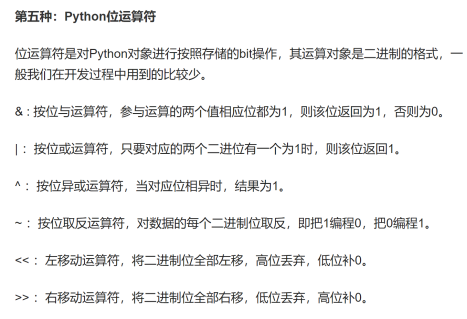​

### 运算优先顺序

​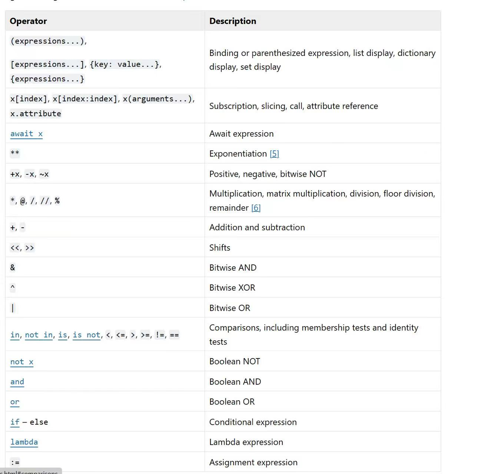​

## Part7 面向对象

一个简单的例子

```python
class people(object):
	def _init_(self, name, age):
		self.name = name
		self.age = age

	def show_name():
		print(self.name)
```

在python中要限制函数和变量的访问（只区分公有和私有），就限制变量函数名称，在前面加上下划线例如（ '_name' ), 则为私有成员，其余均为公有成员

```python
def main:
	one = people("hello", 20)

```

@property 装饰器，来定义访问器和修改器

```python
	@property
    def name(self):
        return self._name

    # 访问器 - getter方法
    @property
    def age(self):
        return self._age

    # 修改器 - setter方法
    @age.setter
    def age(self, age):
        self._age = age
```

@staticmethod 定义静态方法，可以通过`objectName.methodName`​​ 直接调用

## 命名空间和作用域

Python对于一个代码块有三个命名空间

* 局部+全局+内置

定义在函数外的都是全局变量

```python
def selSort():
    print(b)
b = 1
selSort() 输出1
```

如果需要在函数内显示地使用全局变量，需要用global关键词，不然系统会认为我们创建了一个局部变量，global就是做一个声明，`global b = 2`​是错的

```python
def selSort():
    b = 2 
	#global b 
	#b = 2
    print(b)
b = 1
print(b) 1
selSort() 2
print(b) 1 可以发现没有影响到外面
```

## 拷贝 or 引用

python对整数变量修改会改变内存地址，所以id()函数的返回值会改变

拷贝和移动是每一个编程语言都要处理的问题，尤其是存在复杂内存模型的语言

* 赋值
* 浅拷贝 单纯拷贝一层
* 深拷贝

```python
import copy
a = {1:2}
b = copy.copy(a)
c = copy.deepcopy(a)
d = a
```

在python中，对于列表的简单乘法，导致的结果是创建几个看似独立，但是共用相同内存的列表

​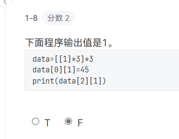​

## 语句

‘\’是续行符

## 异常处理

```Cpp
try:
	代码块
except ValueError:
	...
except ZeroDivisionError:
	...
print("end")
```

## 常用的库

### 常见的方法

* ​`sum()`​sum用来做list的相加
* ​`id()`​ 查看地址，对于可变变量，变了id也不变；对于不可变变了，变量id也变
* ​`abs()`​ 求绝对值，如果对于复数，就是求长度 `abs(3+4j)==5.0`​
* ​`map(lamdba,)`​
* ​`eval`​
* ​`exec("print(1)")`​
* ​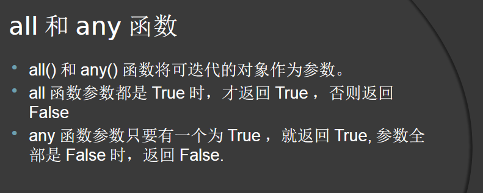​
* ​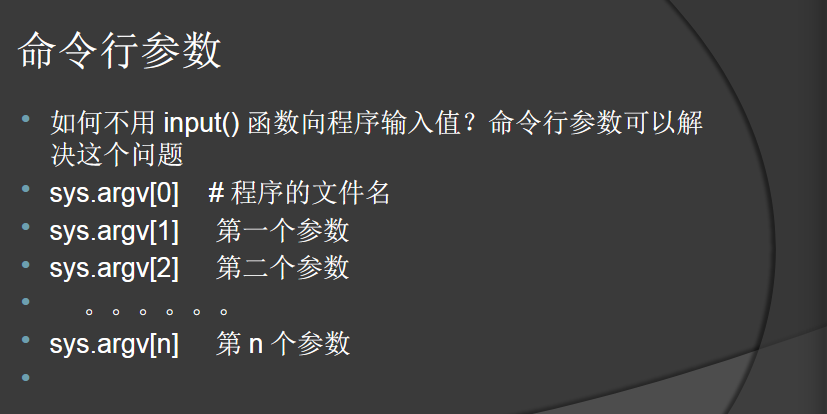​

### math

sqrt函数输出是浮点数，输出的时候要带一位小数

```python
import math   
from math import sqrt
print(math.sqrt(5))
print(sqrt(5))
```

### dis

dis反汇编查询

### random

* shuffle() 打乱列表的顺序，是直接在原列表上打乱，返回值是None
* random 生成0.0到1.0 左闭右开
* uniform 闭合
* randint 闭合
* randrange

​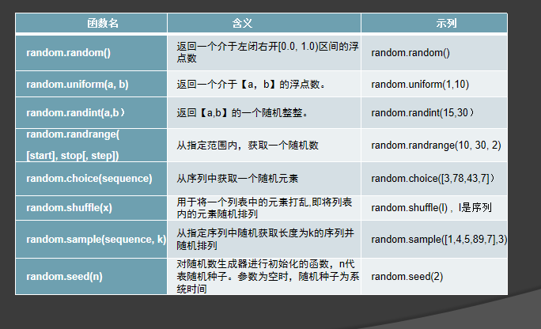​

### sort 和 sorted

sort是list的方法

```python
list.sort(cmp=None, key=None, reverse=False)
```

sorted也只能对list，因此对于字典对象，需要先调用.items()，当然返回的结果也是列表，然后内部元素是元组

```python
d1 = sorted(d1.items(),key=lambda x : ord(x[0]) if type(x[0]) == str else x[0])
```

### ast

通过字符串转换列表和字典的方法

```python
temp = ast.literal_eval(input())
```

## 文件读写和异常处理

计算机文件可分为二种： 二进制文件和文本文件

图形文件及文字处理程序等计算机程序都属于二进制文件。这些文件含有特殊的格式及计算机代码。

文本文件则是可以用文字处理程序阅读的简单文本文件。

```python
fileobj = open(name, mode, encoding="")
```

文件打开模式有

​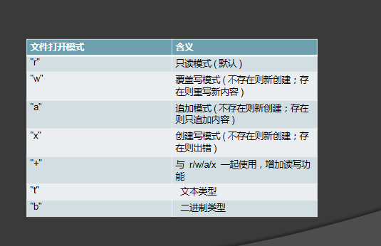​

​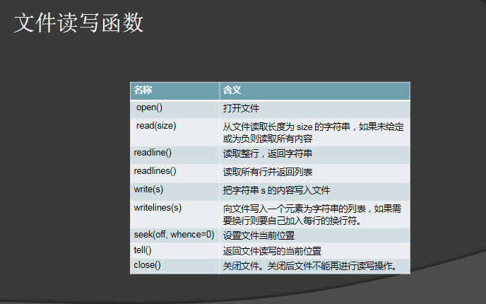​

### 异常处理

```python
short_list = [1, 72, 3]
position = 6
try:
	short_list[position]
except:
	print('索引应该在 0 和', len(short_list)-1,"之间,但却是",position)
```

一般有多个except，并且except后面加上异常类型

​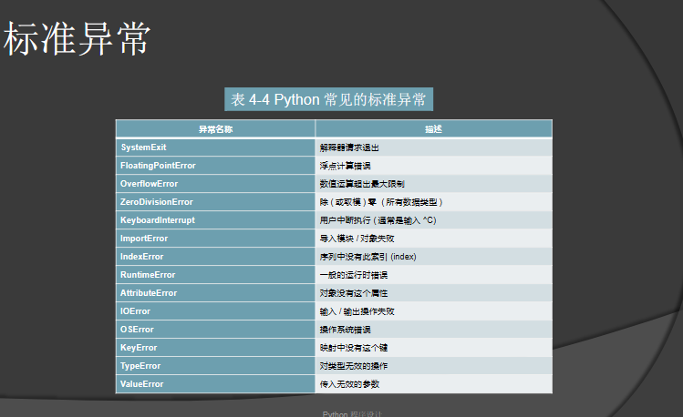​

raise语句，也就是类似throw语句，让我们主动抛出异常

assert语句 断言，并且给异常捕获语句传信息

## 错题

* ​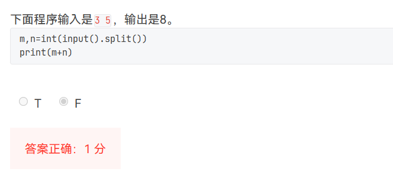​
* ​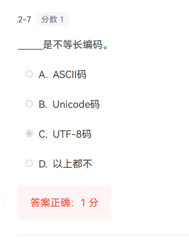​
* ​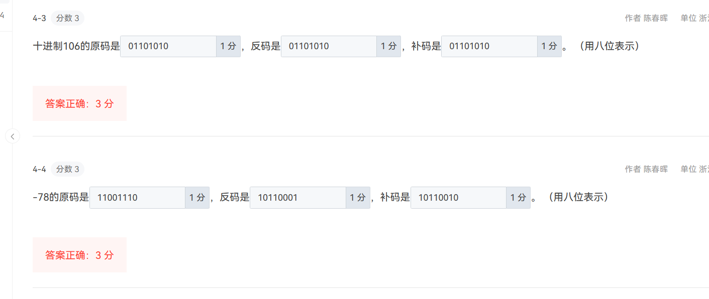​
* round(-100, 00023456, 3)的结果是-100.0，小数点位数n代表是根据小数点后第几位来四舍五入，如果是0就保留一个，并不是保留几位小数的意思  
  ​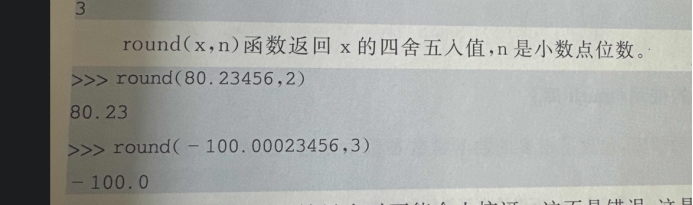​
* ​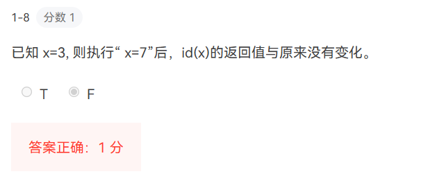​
* ​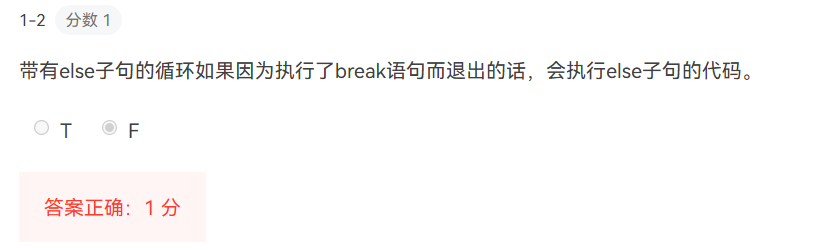​
* ​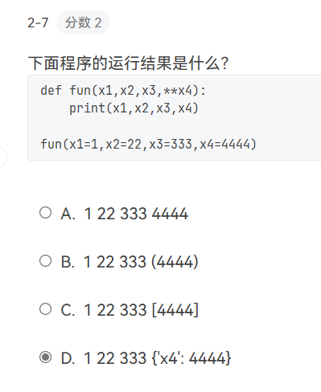​
* ​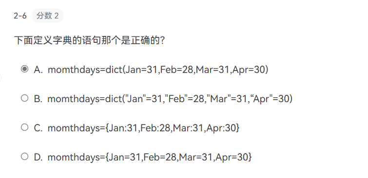​
* ​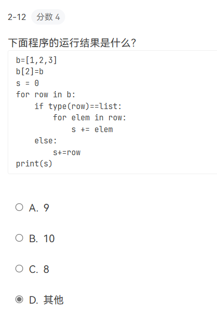​
* ​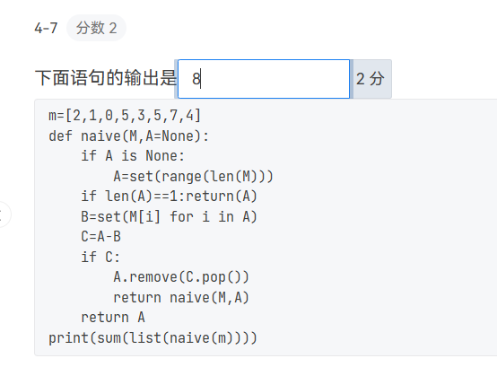​
* ​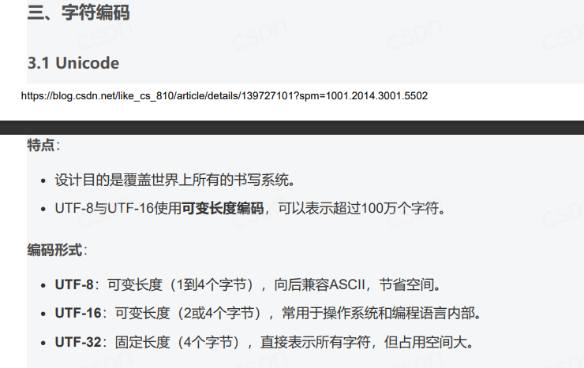​
* ​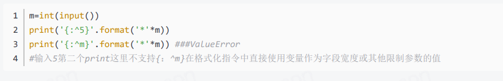​
* ​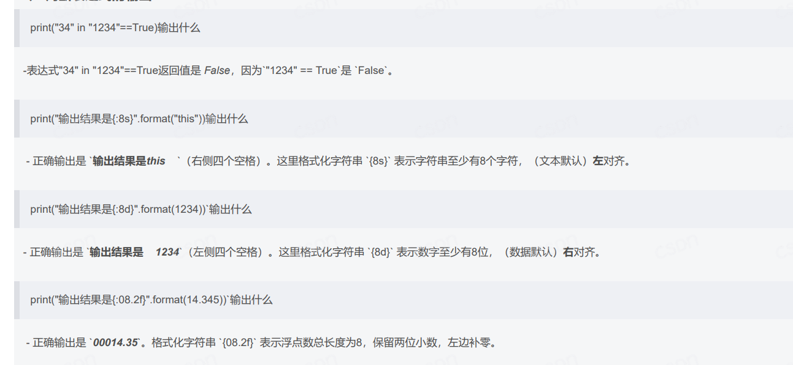​
* ​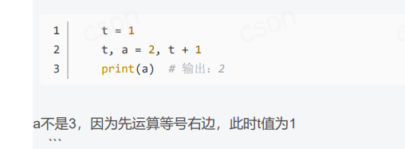​
* ​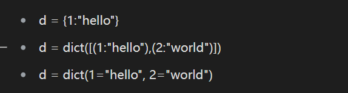​
* ​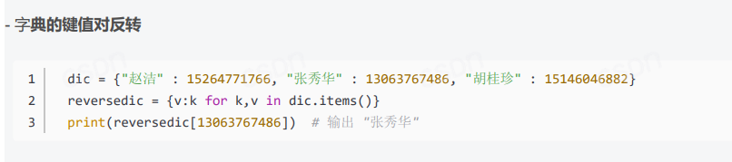​
* ‍

‍
